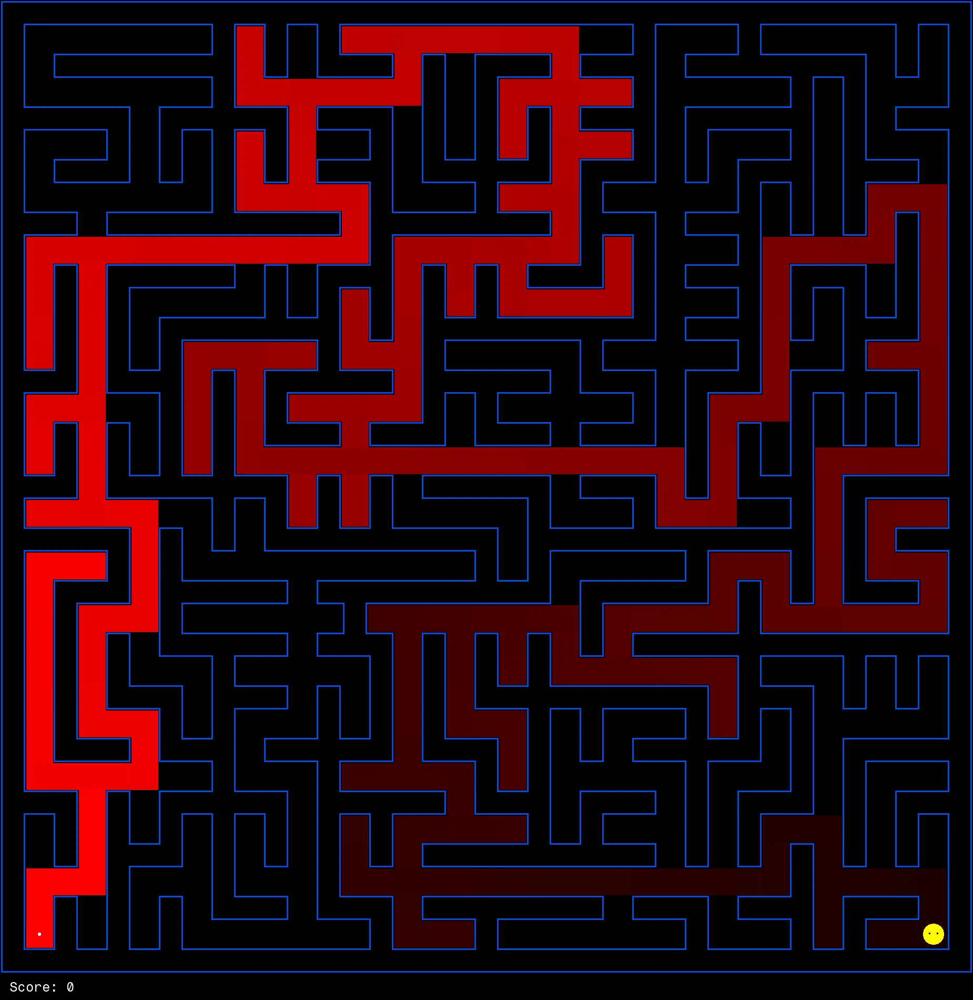

# Project 1: Search in Pac-Man

<p align="center">
    
    </br>
    All those colored walls,</br>
    Mazes give Pac-Man the blues,</br>
    So teach them to search.
</p>

## Introduction

In this project, your Pac-Man agent will find paths through their maze world,
both to reach a particular location and to collect food efficiently.
You will build general search algorithms and apply them to different Pac-Man scenarios.

The code for this project consists of several Python files,
some of which you will need to read and understand in order to complete the assignment, and some you can glance over.

### Submission

You will fill in portions of
[`pacai/student/singlesearch.py`](https://github.com/edulinq/pacai/blob/v2.0.0/pacai/student/singlesearch.py)
during this assignment.
You should **only** submit this file.

For instructions on submission,
refer back to the [P0 README](../p0/README.md).
for example, you may submit with the command:
```sh
python3 -m autograder.run.submit pacai/student/singlesearch.py
```

### Evaluation

Your code will be autograded for technical correctness.
Please _do not_ change the names of any provided functions or classes within the code,
or you will wreak havoc on the autograder (and points will be deducted!).
However, you are allowed to add any new classes or function that you need.
The correctness of your implementation -- not the autograder's output -- will be the final judge of your score.
If necessary, we will review and grade assignments individually to ensure that you receive due credit for your work.
This assignment is graded out of 25 points.
20 points will be for correctness as determined by the autograder and the point system given below for each problem.
5 points will be for style, which the autograder will also check.
You can run the style checker using the `run_style.sh` script in the project root.

### Academic Dishonesty

We will be checking your code against other submissions in the class for logical redundancy.
If you copy someone else's code and submit it with minor changes, we will know.
These cheat detectors are quite hard to fool, so please don't try.
We trust you all to submit your own work only; _please_ don't let us down.
If you do, we will pursue the strongest consequences available to us.

### Getting Help

You are not alone!
If you find yourself stuck on something, contact the course staff for help.
Office hours, section, and Piazza are there for your support; please use them.
If you can't make our office hours, let us know and we will schedule more.
We want these projects to be rewarding and instructional, not frustrating and demoralizing.
But, we don't know when or how to help unless you ask.
One more piece of advice: if you don't know what a variable does or what kind of values it takes, print it out.

### Code

All the code for this (and later projects) is available in this repository:
[https://github.com/edulinq/pacai](https://github.com/edulinq/pacai).
The only files you should edit are located in the
[pacai.student](https://github.com/edulinq/pacai/tree/v2.0.0/pacai/student) package.
You should **not** use any third-party libraries,
but the [Python Standard Library](https://docs.python.org/3/library/) is fair-game.
If a bug is found in the (non-student) code,
then the class will be alerted and you will have to pull the changes from this repository.

Any commands provided throughout these instructions are to be executed from the project root directory
(the one with the `README.md` and `LICENSE.md` files).

There are many files that will be used throughout this quarter-long project.
Below are a few that you may want to look over for this assignment.

 - Core Engine Elements
   - [pacai.core.action.Action](https://edulinq.github.io/pacai/docs/v2.0.0/pacai/core/action.html#Action)
   - [pacai.core.board.Board](https://edulinq.github.io/pacai/docs/v2.0.0/pacai/core/board.html#Board)
   - [pacai.core.board.Position](https://edulinq.github.io/pacai/docs/v2.0.0/pacai/core/board.html#Position)
   - [pacai.core.gamestate.GameState](https://edulinq.github.io/pacai/docs/v2.0.0/pacai/core/gamestate.html#GameState)
   - [pacai.pacman.gamestate.GameState](https://edulinq.github.io/pacai/docs/v2.0.0/pacai/pacman/gamestate.html#GameState)
 - Agents
   - [pacai.core.agent Agent](https://edulinq.github.io/pacai/docs/v2.0.0/pacai/core/agent.html#Agent)
   - [pacai.agents.searchproblem.SearchProblemAgent](https://edulinq.github.io/pacai/docs/v2.0.0/pacai/agents/searchproblem.html#SearchProblemAgent)
   - [pacai.agents.searchproblem.GreedySubproblemSearchAgent](https://edulinq.github.io/pacai/docs/v2.0.0/pacai/agents/searchproblem.html#GreedySubproblemSearchAgent)
 - Search
   - [pacai.core.search](https://edulinq.github.io/pacai/docs/v2.0.0/pacai/core/search.html)
   - [pacai.search.position.PositionSearchProblem](https://edulinq.github.io/pacai/docs/v2.0.0/pacai/search/position.html#PositionSearchProblem)
   - [pacai.search.food.FoodSearchProblem](https://edulinq.github.io/pacai/docs/v2.0.0/pacai/search/food.html#FoodSearchProblem)
 - Data Structures
   - [pacai.util.containers.Stack](https://edulinq.github.io/pacai/docs/v2.0.0/pacai/util/containers.html#Stack)
   - [pacai.util.containers.Queue](https://edulinq.github.io/pacai/docs/v2.0.0/pacai/util/containers.html#Queue)
   - [pacai.util.containers.PriorityQueue](https://edulinq.github.io/pacai/docs/v2.0.0/pacai/util/containers.html#PriorityQueue)
   - [pacai.util.containers.PriorityQueueWithFunction](https://edulinq.github.io/pacai/docs/v2.0.0/pacai/util/containers.html#PriorityQueueWithFunction)

## Welcome to Pac-Man

Welcome to Pac-Man's world, wakka wakka!

Let's jump right into the assignment and play a game with Pac-man!
To begin a game of Pac-Man, use the following command:
```sh
python3 -m pacai.pacman
```

Pac-Man lives in a shiny blue world of twisting corridors and tasty round treats.
Navigating this world efficiently will be Pac-Man's first step in mastering their domain.
Play a quick game and hopefully... Pac-Man emerges victorious!
Lets try and continue this trend of victories throughout the rest of the quarter.

### My First Agent

Since we won't always have direct control over Pac-Man,
let's start working with agents that will control them for us.
One of the simplest agents, [agent-go-west](https://edulinq.github.io/pacai/docs/v2.0.0/pacai/agents/gowest.html#GoWestAgent),
will always goes West (a trivial reflex agent).
Surprisingly, this agent can occasionally win:
```sh
python3 -m pacai.pacman --board maze-test --pacman agent-go-west
```

But, things get ugly for this agent when turning is required:
```sh
python3 -m pacai.pacman --board maze-tiny --pacman agent-go-west
```

If (when) Pac-Man gets stuck, you can exit the game by typing CTRL-c into your terminal.
Soon, your agent will solve not only `maze-tiny`, but any maze you want.

Note that `pacai.pacman` supports a number of options.
You can see the list of all options and their default values via:
```sh
python3 -m pacai.pacman --help
```

_Side Note: pacai Aliases_

Note that we used the string `agent-go-west` to refer to the agent that we wanted to use.
But, the full name for this agent is actually [`pacai.agents.gowest.GoWestAgent`](https://edulinq.github.io/pacai/docs/v2.0.0/pacai/agents/gowest.html#GoWestAgent).
The pacai project uses [aliases](https://edulinq.github.io/pacai/docs/v2.0.0/pacai/util/alias.html) (or "shortcuts") for many of its more common names.
You can always use the either the short name or the long name (whichever you like better).
The assignments in this course will generally use short names so that our commands are more readable.
If you are every confused about what actual Python object you are referencing,
see the [pacai.util.alias](https://github.com/edulinq/pacai/blob/v2.0.0/pacai/util/alias.py) file.

### My First Searches

The [SearchProblemAgent](https://edulinq.github.io/pacai/docs/v2.0.0/pacai/agents/searchproblem.html#SearchProblemAgent)
class plans out a path through Pac-Man's world and then executes that path step-by-step.
It does this by taking in three different components:
 - [SearchProblem](https://edulinq.github.io/pacai/docs/v2.0.0/pacai/core/search.html#SearchProblem) -- This specifies the problem that your agent is to solve,
        and defaults to a [PositionSearchProblem](https://edulinq.github.io/pacai/docs/v2.0.0/pacai/search/position.html#PositionSearchProblem) (which just looks for a specific spot on the board).
 - [SearchProblemSolver](https://edulinq.github.io/pacai/docs/v2.0.0/pacai/core/search.html#SearchProblemSolver) -- This is a function that can solve the search problem,
        and defaults to [random_search](https://edulinq.github.io/pacai/docs/v2.0.0/pacai/search/random.html#random_search) (which just chooses actions randomly).
        Only specialized or ridiculous solvers are provided in the default code.
        It will be your task to implement **real** solvers.
 - [SearchHeuristic](https://edulinq.github.io/pacai/docs/v2.0.0/pacai/core/search.html#SearchHeuristic) -- This is a function that helps the solver score states,
        and defaults to [null_heuristic](https://edulinq.github.io/pacai/docs/v2.0.0/pacai/search/common.html#null_heuristic) (which just scores everything zero).
        Not all searches will use heuristics, but the right heuristic can make all the difference.

You can see the default agent/search in action by running:
```
python3 -m pacai.pacman --board maze-tiny --pacman agent-search-problem
```

Look at this ridiculous agent ...
The goal is right there, and it just flops around for way too long until actually reaching the goal!
Note that you can ignore the red for now, that will come up later.

_Side Note: Random Seeds_

Throughout this course there will be elements of randomness everywhere you look
(this is just the nature of AI).
The agent we just saw used randomness to decide every action it took.
This randomness can be interesting and funny,
but not great when we need to do things like assign you a grade.
So when we need to control randomness, we will use [random seeds](https://en.wikipedia.org/wiki/Random_seed).
Random seeds (or just "seeds") act as a way to prime our [random number generators (RNGs)](https://en.wikipedia.org/wiki/Pseudorandom_number_generator)
so that we always get the same sequence of random numbers each time.

You can see this in action by using the `--seed` argument:
```
python3 -m pacai.pacman --board maze-tiny --pacman agent-search-problem --seed 4
```

If you run it again, you should see the exact same result.
(If you don't please tell a TA, because that is a big problem!)

And with a different seed, you get a different result:
```
python3 -m pacai.pacman --board maze-tiny --pacman agent-search-problem --seed 5
```

If no seed is set, then a random seed is used.
(Yeah, we can use a random number to seed our random number generator.)

_End Side Note_

Using a random search will always work (given an infinite amount of time),
but it is pretty inefficient.
So it is a general search that will always work but it inefficient.
We can also create searches that are optimal, but super specific.
For the `maze-tiny` board, we can use the [search-solver-maze-tiny](https://edulinq.github.io/pacai/docs/v2.0.0/pacai/search/mazetiny.html#maze_tiny_search):
```
python3 -m pacai.pacman --board maze-tiny --pacman agent-search-problem --agent-arg 0::solver=search-solver-maze-tiny
```

You can see that our specialized solver gets a much better score than the random solver.
But, we can also see our agent fail right away on different boards:
```
python3 -m pacai.pacman --board maze-small --pacman agent-search-problem --agent-arg 0::solver=search-solver-maze-tiny
```

The agent got in trouble by the game for trying to do an illegal action
(moving into a wall).

Before we continue on, let's break down that new argument we used on the command-line: `--agent-arg 0::solver=search-solver-maze-tiny`.
The first part `--agent-arg` is of course just the flag that tells the executable how to treat the next part: `0::solver=search-solver-maze-tiny`.
Here, we have three different components:
 - `0` -- This tells the game which agent to send this argument to. Pac-Man is always agent 0.
 - `solver` -- This is the key that the [SearchProblemSolver](https://edulinq.github.io/pacai/docs/v2.0.0/pacai/core/search.html#SearchProblemSolver) agent uses for solver functions.
    Every agent is allowed to use whatever keys they want.
 - `search-solver-maze-tiny` -- The value for our [SearchProblemSolver](https://edulinq.github.io/pacai/docs/v2.0.0/pacai/core/search.html#SearchProblemSolver).
    This string is actually an [alias](https://edulinq.github.io/pacai/docs/v2.0.0/pacai/util/alias.html)
    for [`pacai.search.mazetiny.maze_tiny_search`](https://edulinq.github.io/pacai/docs/v2.0.0/pacai/search/mazetiny.html#maze_tiny_search),
    which is the full name for this solver.

### Making a Real Search

Now that we have seen a general (but stupid) and a specific (but optimal) search,
it's time to write full-fledged generic search functions to help Pac-Man plan routes!
Pseudocode for the search algorithms you'll write can be found in the lecture slides and textbook.

Some things to remember:
 - A [search node](https://edulinq.github.io/pacai/docs/v2.0.0/pacai/core/search.html#SearchNode) should contain not only information about the current state/status of the search,
    but also the information necessary to reconstruct the path (plan) which gets to that state.
 - A [search solution](https://edulinq.github.io/pacai/docs/v2.0.0/pacai/core/search.html#SearchSolution) needs to contain the cost of the solution
    as well as a list of legal action (no moving through walls!) that gets the agent from the start to the goal.
 - Many search algorithms are very similar.
    Algorithms for DFS, BFS, UCS, and A* differ only in the details of how the fringe is managed.
    So, concentrate on getting DFS right and the rest should be relatively straightforward.
    Indeed, one possible implementation requires only a single generic search method which is configured with an algorithm-specific queuing strategy.
    (Your implementation need _not_ be of this form to receive full credit).
 - You may find some of the following packages useful.
    These are just simple wrappers around other data structures,
    so feel free to make your own if you don't like the provided ones.
   - [pacai.util.containers.Stack](https://edulinq.github.io/pacai/docs/v2.0.0/pacai/util/containers.html#Stack)
   - [pacai.util.containers.Queue](https://edulinq.github.io/pacai/docs/v2.0.0/pacai/util/containers.html#Queue)
   - [pacai.util.containers.PriorityQueue](https://edulinq.github.io/pacai/docs/v2.0.0/pacai/util/containers.html#PriorityQueue)
   - [pacai.util.containers.PriorityQueueWithFunction](https://edulinq.github.io/pacai/docs/v2.0.0/pacai/util/containers.html#PriorityQueueWithFunction)

### Question 1 (2 points)

Implement the [depth-first search (DFS)](https://en.wikipedia.org/wiki/Depth-first_search) algorithm in
[pacai.student.singlesearch.depth_first_search](https://edulinq.github.io/pacai/docs/v2.0.0/pacai/student/singlesearch.html#depth_first_search).
To make your algorithm _complete_, write the graph search version of DFS, which avoids expanding any already visited states (textbook section 3.5).

Remember that it is always alright to put prints in your code (or use a debugger) to help you understand what it is doing.
Printing things like
the problem's starting state (`problem.get_starting_node()`),
if a node is a goal (`problem.is_goal_node()`),
and successor nodes (`problem.get_successor_nodes()`) can all be helpful.

Your code should quickly find a solution for the three following mazes and make a fool out of the random search we saw above:
```sh
# Tiny Maze
python3 -m pacai.pacman --board maze-tiny --pacman agent-search-problem --agent-arg 0::solver=search-solver-dfs

# Medium Maze
python3 -m pacai.pacman --board maze-medium --pacman agent-search-problem --agent-arg 0::solver=search-solver-dfs

# Big Maze
python3 -m pacai.pacman --board maze-big --pacman agent-search-problem --agent-arg 0::solver=search-solver-dfs
```

Note that Pac-Man board will show an overlay of the states explored,
and the order in which they were explored
(deeper red means later exploration).
Is the exploration order what you would have expected?
Does Pac-Man actually go to all the explored squares on their way to the goal?

If you use a [pacai.util.containers.Stack](https://edulinq.github.io/pacai/docs/v2.0.0/pacai/util/containers.html#Stack) as your data structure,
the solution found by your DFS algorithm for `maze-medium` should have a length of 153 steps.
Note that positions are always given in clockwise order (North, East, South, West),
and stacks pop the most recent element pushed onto it.
When your agent reaches a junction, does it check directions in a counter clockwise order?
If you are getting 244, you probably pushed the successors onto the fringe in the reverse order provided by
[SearchProblem.get_successor_nodes](https://edulinq.github.io/pacai/docs/v2.0.0/pacai/core/search.html#SearchProblem.get_successor_nodes).

Is the solution produced by DFS a least cost solution?
If not, think about what depth-first search could be doing better.
It's not that DFS is "wrong" (it is doing exactly as it was designed to do),
but even a search that is operating correctly won't produce the best results.

### Question 2 (1 point)

Implement the [breadth-first search (BFS)](https://en.wikipedia.org/wiki/Breadth-first_search) algorithm in
[pacai.student.singlesearch.breadth_first_search](https://edulinq.github.io/pacai/docs/v2.0.0/pacai/student/singlesearch.html#breadth_first_search).
Again, write a graph search algorithm that avoids expanding any already visited states.
Test your code the same way you did for depth-first search.

```sh
# Tiny Maze
python3 -m pacai.pacman --board maze-tiny --pacman agent-search-problem --agent-arg 0::solver=search-solver-bfs

# Medium Maze
python3 -m pacai.pacman --board maze-medium --pacman agent-search-problem --agent-arg 0::solver=search-solver-bfs

# Big Maze
python3 -m pacai.pacman --board maze-big --pacman agent-search-problem --agent-arg 0::solver=search-solver-bfs
```

How did BFS do compared to DFS?
Did it find a better solution?
How does the number of expanded nodes compare?

_Hint:_
If Pac-Man moves too slowly for you, increase the fps (frames per second) using the `--fps` flag, e.g., `--fps 50`.

If you've written your search code generically, your code should work equally well for the eight-puzzle search problem (textbook section 3.2) without any changes.

```sh
python3 -m pacai.eightpuzzle --interactive --solver search-solver-bfs
```

You can see how bad random search does at this (warning: this will probably fill up your entire terminal with text):
```sh
python3 -m pacai.eightpuzzle
```

## Varying the Cost Function

While BFS will find a fewest-actions path to the goal,
we might want to find paths that are "best" in other senses.
Consider `maze-medium-dotted` and `maze-medium-scary`.

```sh
# Medium Dotted Maze
python3 -m pacai.pacman --board maze-medium-dotted --pacman agent-search-problem --agent-arg 0::solver=search-solver-bfs --max-turns 100
```

You agent will make it to the "end" of the maze,
but won't collect all the food along the way
(which is considered a "loss" in a traditional Pac-Man sense).
Note that `--max-turns 100` is just to end the game,
which will never naturally end (since Pac-Man did not eat all the food.
You can also use Ctrl-C to end the game.

Now let's try the "scary" maze:
```sh
# Medium Scary Maze
python3 -m pacai.pacman --board maze-medium-scary --pacman agent-search-problem --agent-arg 0::solver=search-solver-bfs --seed 4
```

You agent should have tried to brave the scary portions of the maze and been eaten
(`--seed 4` should have ensured that the ghosts encountered your agent (if your BFS is correct)).
Instead of choosing a path that was safe but more steps,
your agent choose a dangerous (but cheaper) path.

In more complex cases like this, we can change/implement "cost functions"
which can encourage Pac-Man to find different paths.
For example, we can charge more for dangerous steps in ghost-ridden areas or less for steps in food-rich areas,
and a rational Pac-Man agent should adjust its behavior in response.

### Question 3 (2 points)

Implement the [uniform-cost graph search (UCS)](https://en.wikipedia.org/wiki/Dijkstra%27s_algorithm#Practical_optimizations_and_infinite_graphs) algorithm in
[pacai.student.singlesearch.uniform_cost_search](https://edulinq.github.io/pacai/docs/v2.0.0/pacai/student/singlesearch.html#uniform_cost_search).
You should now observe successful behavior in all three of the following layouts.
Here the agents are all UCS agents that differ only in the cost function they use (the agents and cost functions are written for you).

Here we have the default search agent using [pacai.student.singlesearch.uniform_cost_search](https://edulinq.github.io/pacai/docs/v2.0.0/pacai/student/singlesearch.html#uniform_cost_search),
just like we saw with DFS and BFS:
```sh
python3 -m pacai.pacman --board maze-medium --pacman agent-search-problem --agent-arg 0::solver=search-solver-ucs
```

Note the similarities with BFS.

Now let's try with a different cost function, [pacai.search.common.stay_east_cost_function](https://edulinq.github.io/pacai/docs/v2.0.0/pacai/search/common.html#stay_east_cost_function):
```sh
python3 -m pacai.pacman --board maze-medium-dotted --pacman agent-search-problem --agent-arg 0::solver=search-solver-ucs --agent-arg 0::problem_cost=cost-stay-east
```

Note that this cost function gives a better (lower) cost to position that are on the east/right side of the board.
Therefore, we were able to prioritize a path that happened to eat all the food!

Let's tackle the scary maze with a cost function that prioritizes west/left positions, [pacai.search.common.stay_west_cost_function](https://edulinq.github.io/pacai/docs/v2.0.0/pacai/search/common.html#stay_west_cost_function):
```sh
python3 -m pacai.pacman --board maze-medium-scary --pacman agent-search-problem --agent-arg 0::solver=search-solver-ucs --agent-arg 0::problem_cost=cost-stay-west --fps 100
```

Phew!
We escaped those persistent ghosts.

Note that you should get low and high path costs when using [pacai.search.common.stay_east_cost_function](https://edulinq.github.io/pacai/docs/v2.0.0/pacai/search/common.html#stay_east_cost_function)
and [pacai.search.common.stay_west_cost_function](https://edulinq.github.io/pacai/docs/v2.0.0/pacai/search/common.html#stay_west_cost_function) respectively.
This is due to their exponential cost functions.

## A* search

In the previous question, we saw some of the versatility of UCS.
With an uninformed cost function (which gave everything the same cost), it performs the same as BFS.
But, we were able to change up the cost function and change the paths UCS favored.

Our next search, [A\*](https://en.wikipedia.org/wiki/A*_search_algorithm) (pronounced "A-Star"), combines UCS's ability to use different cost functions to score the path
with the ability to have a [heuristic function](https://en.wikipedia.org/wiki/Heuristic_(computer_science)) that can score state of the search problem.

### Question 4 (3 points)

Implement [A\* graph search](https://en.wikipedia.org/wiki/A*_search_algorithm) algorithm in
[pacai.student.singlesearch.astar_search](https://edulinq.github.io/pacai/docs/v2.0.0/pacai/student/singlesearch.html#astar_search).
A* takes a heuristic function ([pacai.core.search.SearchHeuristic](https://edulinq.github.io/pacai/docs/v2.0.0/pacai/core/search.html#SearchHeuristic)) as an argument.
These heuristic functions take two arguments: a node in the search problem
([pacai.core.search.SearchNode](https://edulinq.github.io/pacai/docs/v2.0.0/pacai/core/search.html#SearchNode)) and the search problem itself
([pacai.core.search.SearchProblem](https://edulinq.github.io/pacai/docs/v2.0.0/pacai/core/search.html#SearchProblem)).

The default heuristic ([pacai.search.common.null heuristic](https://edulinq.github.io/pacai/docs/v2.0.0/pacai/search/common.html#null_heuristic))
is a trivial example of a heuristic that scores everything the same (0.0).
If you start by testing using the null heuristic (which is default), you should see the same behavior as UCS (since your heuristic is adding nothing):
```sh
# UCS
python3 -m pacai.pacman --board maze-medium --pacman agent-search-problem --agent-arg 0::solver=search-solver-ucs

# A-Star With Null Heuristic
python3 -m pacai.pacman --board maze-medium --pacman agent-search-problem --agent-arg 0::solver=search-solver-astar
```

But if you change your heuristic function,
then you will start to see differences.
For example, let's try using [Manhattan distance](https://simple.wikipedia.org/wiki/Manhattan_distance) as a heuristic
(implemented in [pacai.search.distance.manhattan_heuristic](https://edulinq.github.io/pacai/docs/v2.0.0/pacai/search/distance.html#manhattan_distance)).

```sh
python3 -m pacai.pacman --board maze-medium --pacman agent-search-problem --agent-arg 0::solver=search-solver-astar --agent-arg 0::heuristic=heuristic-manhattan
```

You should see that A* finds the optimal solution slightly faster than uniform cost search.
From around 270 nodes expanded to 220 nodes (ties in priority may vary output).

Experiment around and see how the different searches do for different types of mazes.
For example, `maze-contours` and `maze-open` are "mazes" with much more open layouts.

## Finding All the Corners

The real power of A* will only be apparent with a more challenging search problem.
Now, it's time to formulate a new problem and design a heuristic for it.

In "corner" mazes, there are four dots, one in each corner.
Our new search problem is to find the shortest path through the maze that touches all four corners (whether the maze actually has food there or not).
Note that for some mazes like `corners-tiny`, the shortest path does not always go to the closest food first!
_Hint_: the shortest path through `corners-tiny` takes 28 steps.

### Question 5 (2 points)

Implement the search problem
[pacai.student.singlesearch.CornersSearchProblem](https://edulinq.github.io/pacai/docs/v2.0.0/pacai/student/singlesearch.html#CornersSearchProblem).
To do this, you will also need to implement your [pacai.student.singlesearch.CornersSearchNode](https://edulinq.github.io/pacai/docs/v2.0.0/pacai/student/singlesearch.html#CornersSearchNode))
that encodes all the information necessary to detect whether all four corners have been reached.
Make sure to look at [pacai.search.position.PositionSearchProblem](https://edulinq.github.io/pacai/docs/v2.0.0/pacai/search/position.html#PositionSearchProblem) for reference.

Now, your search agent should solve the following:
```sh
# Corners Problem on a Tiny Maze
python3 -m pacai.pacman --board corners-tiny --pacman agent-search-problem --agent-arg 0::problem=search-problem-corners --agent-arg 0::solver=search-solver-bfs


# Corners Problem on a Medium Maze
python3 -m pacai.pacman --board corners-medium --pacman agent-search-problem --agent-arg 0::problem=search-problem-corners --agent-arg 0::solver=search-solver-bfs
```

To receive full credit, you need to define an abstract search node representation that **does not** encode irrelevant information (like the position of ghosts, where extra food is, etc.).
In particular, do not use game states (like [pacai.pacman.gamestate.GameState](https://edulinq.github.io/pacai/docs/v2.0.0/pacai/pacman/gamestate.html#GameState) as a search node/state.
Your code will be very, very slow if you do (and also wrong).

_Hint:_
The only parts of the game state you need to reference in your search problem implementation is the starting agent (Pac-Man) position, the location of the four corners, and the board.

Our implementation of [pacai.student.singlesearch.breadth_first_search](https://edulinq.github.io/pacai/docs/v2.0.0/pacai/student/singlesearch.html#breadth_first_search)
expands just under 2000 search nodes on `corners-medium`.
However, heuristics (used with A* search) can reduce the amount of searching required.

### Question 6 (3 points)

Now that we have the basic [pacai.student.singlesearch.CornersSearchProblem](https://edulinq.github.io/pacai/docs/v2.0.0/pacai/student/singlesearch.html#CornersSearchProblem) working,
let's try to solve it even faster using A\*!
Implement the [pacai.student.singlesearch.corners_heuristic](https://edulinq.github.io/pacai/docs/v2.0.0/pacai/student/singlesearch.html#corners_heuristic).

To test your code run:
```sh
# A* With Null Heuristic
python3 -m pacai.pacman --board corners-medium --pacman agent-search-problem --agent-arg 0::problem=search-problem-corners --agent-arg 0::solver=search-solver-astar

# A* With Corners Heuristic
python3 -m pacai.pacman --board corners-medium --pacman agent-search-problem --agent-arg 0::problem=search-problem-corners --agent-arg 0::solver=search-solver-astar --agent-arg 0::heuristic=heuristic-corners
```

Your agent should not be expanding significantly less nodes while still reaching the same solution.

Grading:
- 0 points for inadmissible heuristics.
- 1 point for **any** admissible heuristic.
- 2 points for expanding fewer than **1600** nodes.
- 3 points for expanding fewer than **1200** nodes.
- Expand fewer than **800**, and you're doing great!

_Hint:_
Remember, heuristic functions just return numbers, which, to be admissible,
must be lower bounds on the actual shortest path cost to the nearest goal.

## Eating All The Dots

Now we'll solve a hard search problem: eating all the Pac-Man food in as few steps as possible.
For this, a new search problem definition which formalizes the food-clearing problem can be found in
[pacai.search.food.FoodSearchProblem](https://edulinq.github.io/pacai/docs/v2.0.0/pacai/search/food.html#FoodSearchProblem).
A solution is defined to be a path that collects all of the food in the Pac-Man world.

For the present project, solutions do not take into account any ghosts or power pellets.
They only depend on the placement of walls, regular food, and Pac-Man.
Of course ghosts can ruin the execution of a solution!
We'll get to that in the next assignment :)

If you have written your general search methods correctly, A\* with a null heuristic (UCS)
should quickly find an optimal solution to `search-test` with a total cost of 7 and no code change on your part:
```sh
python3 -m pacai.pacman --board search-test --pacman agent-search-problem --agent-arg 0::problem=search-problem-food --agent-arg 0::solver=search-solver-astar
```

You should find that UCS (uninformed A\*) starts to slow down even for the seemingly simple `search-tiny`.
As a reference, finds a path of length 27 after expanding about 5000 search nodes:
```sh
python3 -m pacai.pacman --board search-tiny --pacman agent-search-problem --agent-arg 0::problem=search-problem-food --agent-arg 0::solver=search-solver-astar
```

Despite being slow, this can even solve `maze-medium-dotted` without any special information:
```sh
python3 -m pacai.pacman --board maze-medium-dotted --pacman agent-search-problem --agent-arg 0::problem=search-problem-food --agent-arg 0::solver=search-solver-astar
```

### Question 7 (5 points)

Try using your A\* on the `search-tricky` board:
```sh
python3 -m pacai.pacman --board search-tricky --pacman agent-search-problem --agent-arg 0::problem=search-problem-food --agent-arg 0::solver=search-solver-astar
```

Our reference implementation finds the optimal solution after exploring around 16,000 nodes.

Let's try to improve on this using a new heuristic,
[pacai.search.food.FoodSearchProblem](https://edulinq.github.io/pacai/docs/v2.0.0/pacai/search/food.html#FoodSearchProblem)
in [pacai.student.singlesearch.food_heuristic](https://edulinq.github.io/pacai/docs/v2.0.0/pacai/student/singlesearch.html#food_heuristic):
```sh
python3 -m pacai.pacman --board search-tricky --pacman agent-search-problem --agent-arg 0::problem=search-problem-food --agent-arg 0::solver=search-solver-astar --agent-arg 0::heuristic=heuristic-food
```

If your heuristic is admissible, you will receive the following score, depending on how many nodes your heuristic expands:
- 0 points for inadmissible heuristics.
- 1 point for expanding fewer than **15000** nodes (very easy).
- 2 points for expanding fewer than **12000** nodes (easy).
- 3 points for expanding fewer than **9000** nodes (medium).
- 4 points for expanding fewer than **7000** nodes (hard).

Think through admissibility carefully, as inadmissible heuristics may manage to produce fast searches and even optimal paths.
Can you solve `search-medium` in a short time?
If so, we're either very impressed, or your heuristic is inadmissible.

#### Admissibility vs. Consistency?

Technically, admissibility isn't enough to guarantee correctness in graph search -- you need the stronger condition of consistency.
For a heuristic to be consistent, it must hold that if an action has cost $c$, then taking that action can only cause a drop in heuristic of at most $c$.
If your heuristic is not only admissible, but also consistent, you will receive **1 additional point** for this question.

Almost always, admissible heuristics are also consistent, especially if they are derived from problem relaxations.
Therefore, it is probably easiest to start out by brainstorming admissible heuristics.
Once you have an admissible heuristic that works well, you can check whether it is indeed consistent, too.
Inconsistency can sometimes be detected by verifying that your returned solutions are non-decreasing in f-value.
Moreover, if UCS and A* ever return paths of different lengths, your heuristic is inconsistent.
This stuff is tricky.
If you need help, don't hesitate to ask the TAs!

## Suboptimal Search

Sometimes, even with A* and a good heuristic, finding the optimal path through all the dots is hard.
In these cases, we'd still like to find a reasonably good path, quickly.
In this section, you'll write an agent that always eats the closest dot.

### Question 8 (2 points)

Implement the class [pacai.student.singlesearch.ClosestDotSearchAgent](https://edulinq.github.io/pacai/docs/v2.0.0/pacai/student/singlesearch.html#ClosestDotSearchAgent).
This agent is a subclass of [pacai.agents.searchproblem.GreedySubproblemSearchAgent](https://edulinq.github.io/pacai/docs/v2.0.0/pacai/agents/searchproblem.html#GreedySubproblemSearchAgent).
This greedy agent (named because it uses a [greedy algorithm](https://en.wikipedia.org/wiki/Greedy_algorithm),
not because of its personality)
will look for the closest dot/food, move to it, and the look for the next closest foot.
It will repeat this process until all the food has been eaten.

There are generally two ways to implement this agent:
 1) A hard/long way where you implement everything from scratch.
 2) A simple way where you have to really understand all the involved code, but only need to write a few lines of code.
    This method would leverage [pacai.student.singlesearch.AnyMarkerSearchProblem](https://edulinq.github.io/pacai/docs/v2.0.0/pacai/student/singlesearch.html#AnyMarkerSearchProblem), which you would also need to implement.

Of course we would prefer if you implement the simple version,
but you are free to implement this agent how you see fit.
We only check how your agent performs,
not how it is implemented.

Try out your agent on a big search board:
```sh
python3 -m pacai.pacman --board search-big --pacman agent-search-closest-dot
```

Our agent solves this maze (suboptimally!) in under 1/10 of a second with a path cost of around 350!
The path may not be optimal, but the agent came up with a path very quickly.
This highlights an important note about being practical when building software systems.
Sometimes suboptimal approaches may be okay, if we can reach an answer quickly.
In this example, we can plan a path and even finish eating all the dots before an optimal search could even finish planning a path.

#### Extra: Approximate Search (2 points extra credit)

Implement an [pacai.student.singlesearch.ApproximateSearchAgent](https://edulinq.github.io/pacai/docs/v2.0.0/pacai/student/singlesearch.html#ApproximateSearchAgent)
that finds a short path through `search-big` in **under** 2 seconds!.
Official timing is done on the autograder,
so being very close to two seconds on your local machine may not be good enough.
Our agent finishes in less than half a second,
so 2 seconds is very possible.

We will run your agent with null graphics and a consistent (but hidden) seed:
```sh
python3 -m pacai.pacman --board search-big --pacman agent-search-approx --seed 123 --ui null
```

You may not hard-code any paths.
