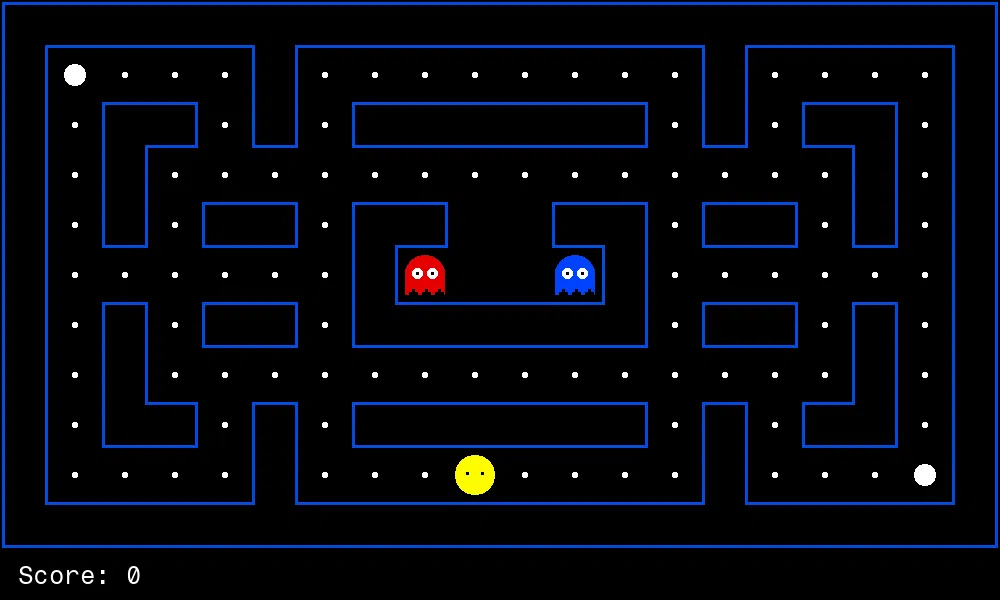

# Project 2: Multi-Agent Pac-Man

<p align="center">
    
    </br>
    Pac-Man, now with ghosts.</br>
    Minimax, Expectimax,</br>
    Evaluation.
</p>

## Introduction

In this project, you will design agents for the classic version of Pac-Man, including ghosts.
Along the way, you will implement both
[minimax](https://en.wikipedia.org/wiki/Minimax)
and [expectimax](https://en.wikipedia.org/wiki/Expectiminimax)
search and try your hand at evaluation function design.

The code for this project consists of several Python files,
some of which you will need to read and understand in order to complete the assignment, and some you can glance over.

### Submission

You will fill in portions of
[`pacai/student/multiagents.py`](https://github.com/edulinq/pacai/blob/main/pacai/student/multiagents.py)
during this assignment.
You should **only** submit this file.

For instructions on submission,
refer back to the [P0 README](../p0/README.md).
for example, you may submit with the command:
```sh
python3 -m autograder.run.submit pacai/student/multiagents.py
```

### Evaluation

Your code will be autograded for technical correctness.
Please _do not_ change the names of any provided functions or classes within the code,
or you will wreak havoc on the autograder (and points will be deducted!).
However, you are allowed to add any new classes or function that you need.
The correctness of your implementation -- not the autograder's output -- will be the final judge of your score.
If necessary, we will review and grade assignments individually to ensure that you receive due credit for your work.
This assignment is graded out of 25 points.
20 points will be for correctness as determined by the autograder and the point system given below for each problem.
5 points will be for style, which the autograder will also check.
You can run the style checker using the `run_style.sh` script in the project root.

### Academic Dishonesty

We will be checking your code against other submissions in the class for logical redundancy.
If you copy someone else's code and submit it with minor changes, we will know.
These cheat detectors are quite hard to fool, so please don't try.
We trust you all to submit your own work only; _please_ don't let us down.
If you do, we will pursue the strongest consequences available to us.

### Getting Help

You are not alone!
If you find yourself stuck on something, contact the course staff for help.
Office hours, section, and Piazza are there for your support; please use them.
If you can't make our office hours, let us know and we will schedule more.
We want these projects to be rewarding and instructional, not frustrating and demoralizing.
But, we don't know when or how to help unless you ask.
One more piece of advice: if you don't know what a variable does or what kind of values it takes, print it out.

### Code

All the code for this (and later projects) is available in this repository:
[https://github.com/edulinq/pacai](https://github.com/edulinq/pacai).
The only files you should edit are located in the
[pacai.student](https://github.com/edulinq/pacai/tree/v2.0.0/pacai/student) package.
You should **not** use any third-party libraries,
but the [Python Standard Library](https://docs.python.org/3/library/) is fair-game.
If a bug is found in the code (non-student) code,
then the class will be alerted and you will have to pull the changes from this repository.

Any commands provided throughout these instructions are to be executed from the project root directory
(the one with the `README.md` and `LICENSE.md` files).

There are many files that will be used throughout this quarter-long project.
Below are a few that you should focus on for this assignment.

 - Core Engine Elements
   - [pacai.core.action.Action](https://edulinq.github.io/pacai/docs/v2.0.0/pacai/core/action.html#Action)
   - [pacai.core.board.Board](https://edulinq.github.io/pacai/docs/v2.0.0/pacai/core/board.html#Board)
   - [pacai.core.board.Position](https://edulinq.github.io/pacai/docs/v2.0.0/pacai/core/board.html#Position)
   - [pacai.core.gamestate.GameState](https://edulinq.github.io/pacai/docs/v2.0.0/pacai/core/gamestate.html#GameState)
   - [pacai.pacman.gamestate.GameState](https://edulinq.github.io/pacai/docs/v2.0.0/pacai/pacman/gamestate.html#GameState)
 - Agents
   - [pacai.core.agent Agent](https://edulinq.github.io/pacai/docs/v2.0.0/pacai/core/agent.html#Agent)
   - [pacai.agents.greedy.GreedyAgent](https://edulinq.github.io/pacai/docs/v2.0.0/pacai/agents/greedy.html#GreedyAgent)
   - [pacai.agents.minimax.MinimaxLikeAgent](https://edulinq.github.io/pacai/docs/v2.0.0/pacai/agents/minimax.html#MinimaxLikeAgent)

## Multi-Agent Pac-Man

First, play a game of classic Pac-Man:
```sh
python3 -m pacai.pacman
```

Hopefully you had fun.
Now, it's time for the real fun ... programming!

Let's try to have an agent play the game for us.
We will start with a reflex agent
([pacai.student.multiagents.ReflexAgent](https://edulinq.github.io/pacai/docs/v2.0.0/pacai/student/multiagents.html#ReflexAgent)).
"Reflex" agents play the game by not doing any planning,
but just by evaluating game states for is's possible moves and taking the best one.
Try letting a reflex agent play Pac-Man with:
```sh
python3 -m pacai.pacman --pacman agent-reflex
```

Hummm ... it does quite poorly.
It still does bad even on simpler boards:
```sh
python3 -m pacai.pacman --pacman agent-reflex --board classic-test
```

Inspect [its code](https://github.com/edulinq/pacai/blob/v2.0.0/pacai/student/multiagents.py)
and make sure you understand what it's doing.
Note that it is a child of [pacai.agents.greedy.GreedyAgent](https://edulinq.github.io/pacai/docs/v2.0.0/pacai/agents/greedy.html#GreedyAgent),
which just tries to take the action the leads to a state with the best evaluation.

### Question 1 (3 points)

Let's improve the
[pacai.student.multiagents.ReflexAgent](https://edulinq.github.io/pacai/docs/v2.0.0/pacai/student/multiagents.html#ReflexAgent) to play respectably.
You are free to make whatever changes you want,
but your agent must remain a [pacai.agents.greedy.GreedyAgent](https://edulinq.github.io/pacai/docs/v2.0.0/pacai/agents/greedy.html#GreedyAgent)
and a "reflex" agent.
This means that it is not allowed to do any advanced planning and must just react to
the current state of the game, its currently available actions, and the states that come up from those actions.
You can do all of this using just your `evaluate_state()` function (and maybe the constructor).
(But you are still free to write whatever else you need.)

Below are some hints for making a good reflex agent.
Note that you do not need all this information to make a good reflex agent, but it may help:

 - Remember, you can speed up your game with the `--fps` flag.
   - This can be useful if you agent is just flopping around.
 - The [pacai.agents.greedy.GreedyAgent.evaluate_state()](https://edulinq.github.io/pacai/docs/v2.0.0/pacai/core/agent.html#Agent.evaluate_state) method has two arguments:
   - `state` -- The hypothetical state being evaluated (the agent has not yet moved here, but is considering this state).
   - `action` -- The action the agent took to get to this hypothetical state.
 - If an agent (including Pac-Man) is dead, they have a `None` position.
 - Reflex agents have a bad tendency to repeat positions (move back and forth between the same positions).
   - You may find [pacai.core.agent.Agent.last_positions](https://edulinq.github.io/pacai/docs/v2.0.0/pacai/core/agent.html#Agent.last_positions) useful in avoiding this repetition.
 - For this assignment, we know that we are only playing Pac-Man, so you know your game state will be a [pacai.pacman.gamestate.GameState](https://edulinq.github.io/pacai/docs/v2.0.0/pacai/pacman/gamestate.html#GameState).
   - Make sure to look at all the methods and data available to you
     (in both the [Pac-Man game state](https://edulinq.github.io/pacai/docs/v2.0.0/pacai/pacman/gamestate.html#GameState) state
     and [its parent](https://edulinq.github.io/pacai/docs/v2.0.0/pacai/core/gamestate.html#GameState).
 - Pac-Man always has an agent index of 0
   ([pacai.pacman.gamestate.PACMAN_AGENT_INDEX](https://edulinq.github.io/pacai/docs/v2.0.0/pacai/pacman/gamestate.html#PACMAN_AGENT_INDEX)).
   - Agents are almost always referred to by their agent index (which is an int).
   - You can get the agent indexes for all agents (including ghosts) with
     [pacai.core.gamestate.GameState.get_agent_indexes()](https://edulinq.github.io/pacai/docs/v2.0.0/pacai/core/gamestate.html#GameState.get_agent_indexes).
 - You can get the positions of all agents with
   [pacai.core.gamestate.GameState.get_agent_positions()](https://edulinq.github.io/pacai/docs/v2.0.0/pacai/core/gamestate.html#GameState.get_agent_positions).
   - If you just want one agent, you can use
     [pacai.core.gamestate.GameState.get_agent_position()](https://edulinq.github.io/pacai/docs/v2.0.0/pacai/core/gamestate.html#GameState.get_agent_position).
     - If you don't provide an agent index, it will use the current agent.
       - But be careful! You will often be evaluating hypothetical future states where it is other agent's turn to move.
 - You can see how long each ghost will be scared for using
   [pacai.pacman.gamestate.GameState.scared_timers](https://edulinq.github.io/pacai/docs/v2.0.0/pacai/pacman/gamestate.html#GameState.scared_timers).
   - This is the number of turns each ghost will be scared for (a zero or no entry means the ghost is not scared).
   - If you just want to see if a ghost is scared, you an use
     [pacai.pacman.gamestate.GameState.is_scared()](https://edulinq.github.io/pacai/docs/v2.0.0/pacai/pacman/gamestate.html#GameState.is_scared).
 - You can get the position of all food on the board with
   [pacai.pacman.gamestate.GameState.get_food()](https://edulinq.github.io/pacai/docs/v2.0.0/pacai/pacman/gamestate.html#GameState.get_food).
   - This is just a shortcut for `state.board.get_marker_positions(pacai.pacman.board.MARKER_PELLET)`, which you can also use.
 - When you have numeric values, it is often more useful to use the reciprocal than the original value.
   - This is for several reasons, but one of them is normalizing all values into $[0.0, 1.0]$.
 - You should not modify data in your agent base class or the game's state.
   Although you technically can modify the data (you can pretty much modify anything in Python),
   the game will block modification to the state when running with agent isolation on.
   - See the [pacai.core.agent.cheating.CheatingAgent](https://edulinq.github.io/pacai/docs/v2.0.0/pacai/agents/cheating.html#CheatingAgent)
     for an example of what you should not do.
     - Try running a normal Pac-Man game with this agent, and then use the `--isolation procecss` option to see what happens.
 - Don't forget to use `--seed` while developing if the randomness is making things hard for you.
   - You will be graded on different seeds, but you can use one during development to make things more consistent.

Your agent should easily and reliably clear the `classic-test` board:
```sh
python3 -m pacai.pacman --pacman agent-reflex --board classic-test
```

Note that you can run many games to see how well your agent does on average.
This idea of running multiple games is how you will be graded.
You can even run without a GUI to make it super fast:
```sh
python3 -m pacai.pacman --pacman agent-reflex --board classic-test --num-games 10 --ui null
```

For more of a challenge,
try out your reflex agent on the default `classic-medium` board with one and two ghosts.
```sh
# 1 Ghost
python3 -m pacai.pacman --pacman agent-reflex --board classic-medium --num-ghosts 1

# 2 Ghosts (the default)
python3 -m pacai.pacman --pacman agent-reflex --board classic-medium --num-ghosts 2
```

If you can win 50% of the time with one ghost, you are on track.
If you can win 50% of the time with two ghosts, then you are doing quite well.

The autograder will check that your agent can rapidly clear the
`classic-open` board ten times without dying more than twice or taking more than 5,000 turns
(a total of 10,000 since there are two agents).
Our agent takes less than two seconds to run,
dies in about 1 out of 100 games,
and only takes an average of 150 turns
(so you should have plenty of time).
You can try this yourself with the command:
```sh
python3 -m pacai.pacman --pacman agent-reflex --board classic-open --num-games 10 --ui null --max-turns 10000
```

If you want to be sure that you are going to pass this threshold,
try with running with `--num-games 100` or even `--num-games 1000`.
You could always be getting (un)lucky once or twice,
but luck is nothing against computational simulations!

Make sure to balance the time that you spend on this question, the bulk of this project lies ahead
(and you can spend an infinite amount of time tweaking evaluation functions/weights).
However, you may find a lot of the concepts here useful for Question 5.
So you may want to get something working, move on to the next question,
and then revisit this when you get to Question 5
(where you may be able to work on both together).

#### Sidenote: Replays

It can be hard to tell what happened if you just see it once,
so `pacai` gives you the ability to save the record of a game and "replay" it.
You can save a game's record with `--save-path`:
```sh
python3 -m pacai.pacman --pacman agent-reflex --board classic-test --save-path my-game.json
```

Then you can replay a game with `--replay-path`:
```sh
python3 -m pacai.pacman --replay-path my-game.json
```

When you replay a game most options (especially agent-related options) are just ignored,
since the options in the saved game are used.
But, one useful option you can set is `--fps`.
This allows you to play a game and then replay it at a much slower speed:
```sh
python3 -m pacai.pacman --replay-path my-game.json --fps 5
```

Game records are saved as [JSON](https://en.wikipedia.org/wiki/JSON) files,
so you can just open them up and look at them if you want.

### Question 2 (5 points)

You may have noticed that with the reflex agent, your Pac-Man would still sometimes die
(as long as it tries to eat all the food and not just hide in the corner).
That is because as good as your state evaluation may be,
a reflex agent doesn't try to plan for what an opposing agent may do.
An agent that tries to plan what its opponents may do is considered an "adversarial search agent".
In this question, we will try to correct that by implementing an agent that uses
[minimax](https://en.wikipedia.org/wiki/Minimax).
In short, your agent will try to maximize a score (take the best moves) when planning its own turns,
and assume an opposing agent will minimize a score (take the worst moves ("worst" for Pac-Man, "best" for the ghost)) on their turns.

Classic minimax is typically represented with two agents (a "min" agent and a "max" agent).
But, minimax can actually handle as many agents as you want.
A classic "ply" is one max followed by one min (or a min followed by a max depending on your setup).
But, a ply can also be a [max, min, and min], or even a [max, min, min, max, min, max, min].
A ply is just a set of steps where every turn is considered until you get back to yourself (the agent doing the planning).
This works well for Pac-Man where we can have multiple ghosts.
So a ply for a setup with one Pac-Man and two ghosts would be: [max, min, min].
You can even have situations where some agents get to go multiple (or no) times in a single ply.
However, you don't need to worry about coding for these situations.
The existing code will take care of all this for you.

Now you will write an adversarial search agent in
[pacai.student.multiagents.MyMinimaxLikeAgent](https://edulinq.github.io/pacai/docs/v2.0.0/pacai/student/multiagents.html#MyMinimaxLikeAgent).
This agent is a child of [pacai.agents.minimax.MinimaxLikeAgent](https://edulinq.github.io/pacai/docs/v2.0.0/pacai/agents/minimax.html#MinimaxLikeAgent).
MinimaxLikeAgent provides a base that we can start with to implement a few different adversarial search agents.
Please make sure to read the [code for MinimaxLikeAgent](https://github.com/edulinq/pacai/blob/v2.0.0/pacai/agents/minimax.py).

```sh
python3 -m pacai.pacman --pacman agent-minimax --board classic-minimax
```

As you can see, this is a pretty tough board!
Your agent should be winning about 50% of the time at this point.
However, we can increase the number of plys (the search depth) to give our agent an advantage
(at the cost of performance):
```sh
python3 -m pacai.pacman --pacman agent-minimax --board classic-minimax --agent-arg 0::ply_count=4
```

Now we can win about 60% - 70% of the time!

If you are not seeing the results we are talking about here,
then you may need to do some debugging.
You can run with the `--debug` flag to get your agent to output some useful information:
```sh
# Depth 1
python3 -m pacai.pacman --pacman agent-minimax --board classic-minimax --agent-arg 0::ply_count=1 --ui null --debug

# Depth 2
python3 -m pacai.pacman --pacman agent-minimax --board classic-minimax --agent-arg 0::ply_count=2 --ui null --debug

# Depth 3
python3 -m pacai.pacman --pacman agent-minimax --board classic-minimax --agent-arg 0::ply_count=3 --ui null --debug

# Depth 4
python3 -m pacai.pacman --pacman agent-minimax --board classic-minimax --agent-arg 0::ply_count=4 --ui null --debug
```

Specifically, you can see the minimax score at each turn.
On the initial state (turn 0), you should see the following minimax scores:
| Ply Count | Initial State Minimax Score |
|-----------|-----------------------------|
| 1         | 9                           |
| 2         | 8                           |
| 3         | 7                           |
| 4         | -492                        |

If you don't see these scores, then there is a problem with your code.
Make sure you review the code for [pacai.agents.minimax.MinimaxLikeAgent](https://github.com/edulinq/pacai/blob/v2.0.0/pacai/agents/minimax.py).
Note that the scores get worse as our search depth increases.
Think about why our minimax score goes down, but our win rate goes up as we increase the search depth.

Some things to consider:
 - Make sure to not edit the evaluation function.
   - We are using the default evaluation (unlike the reflex agent), which is just the score of the game.
 - Your code may have to consider game states where the current agent is not on the board (they got eaten and have `None` positions).
   - For Pac-Man, this means that the game is now over.
   - But for ghosts, they were also eaten, but will respawn next turn in their starting location.

Note how much longer your agent takes than your more simple reflex agent:
```sh
# Reflex Agent
time python3 -m pacai.pacman --pacman agent-reflex --board classic-open --num-games 20 --ui null

# Minimax Agent
time python3 -m pacai.pacman --pacman agent-minimax --board classic-open --num-games 20 --ui null
```

Don't worry, we'll try to speed up minimax in the next section.

If you think you are a Minimax wizard now,
try solving this puzzle before you move on:
```sh
# Depth 1
python3 -m pacai.pacman --pacman agent-minimax --board classic-trapped --agent-arg 0::ply_count=1 --num-games 100 --ui null

# Depth 2
python3 -m pacai.pacman --pacman agent-minimax --board classic-trapped --agent-arg 0::ply_count=2 --num-games 100 --ui null

# Depth 10!
python3 -m pacai.pacman --pacman agent-minimax --board classic-trapped --agent-arg 0::ply_count=10 --num-games 100 --ui null
```

At depth 1, Pac-Man may be able to survive and win some games.
But at EVERY higher depth, Pac-Man will loose with the exact same score.
Why does this happen?

You will be scored by running games on the `classic-minimax` and `classic-trapped` boards with a ply count of 4:
```sh
# You must win at least 50% of these games.
python3 -m pacai.pacman --pacman agent-minimax --board classic-minimax --agent-arg 0::ply_count=4 --ui null --num-games 100

# You must win ZERO of these games.
python3 -m pacai.pacman --pacman agent-minimax --board classic-trapped --agent-arg 0::ply_count=4 --ui null --num-games 100
```

You must win at least 50% of the `classic-minimax` games and 0% (zero) of the `classic-trapped` games.
Note that to make the grader fast we will not run too many games.
This means that there is a small chance you can get unlucky and you `classic-minimax` games misses the cutoff by a single game.
If you miss the `classic-minimax` cutoff by one but pass `classic-trapped`, you probably just got unlucky and can submit again.
This cannot be used as an excuse for a late submission.

### Question 3 (4 points)

Minimax can take a long time to run (especially with a large depth) because it has a lot of searching/expanding to do.
Minimax has to figure out what each agent can do in many different possible game states, which adds up to a lot of work.
One of the simplest strategies for speeding a process up is just to do less work.
In minimax, we can "do less work" if we can figure out a way to decide if there are nodes/states that we no longer need to look at.
Less nodes to look at means a faster search.
One way we can remove (or "prune") nodes from our search tree is [alpha-beta pruning](https://en.wikipedia.org/wiki/Alpha%E2%80%93beta_pruning).

In this question, you will implement alpha-beta pruning into your
[MyMinimaxLikeAgent](https://edulinq.github.io/pacai/docs/v2.0.0/pacai/student/multiagents.html#MyMinimaxLikeAgent).
Your agent's parent class ([pacai.agents.minimax.MinimaxLikeAgent](https://edulinq.github.io/pacai/docs/v2.0.0/pacai/agents/minimax.html#MinimaxLikeAgent))
already has the code ready to accept the `alphabeta_prune` parameter,
you just have to augment your `minimax_step_max()` and `minimax_step_min()`
to use the `alpha` and `beta` parameters.

Keep in mind that the core intuition for alpha-beta pruning is:
"my opponent is smart and will not allow me to make a better move".
If you keep that in mind, then it makes sense why you may reach a point where you stop considering moves,
you opponent won't let you make those moves anyway.
As an example, image you are playing a game of chess.
You are in a situation where you have only two possible moves: `A` and `B`.
You fully analyze move `A` and find that it puts you in a similar state as before,
not too bad and not too good.
When looking at move `B`, you see that your opponent will have 20 possible moves in response.
However, one of those 20 moves will force a you into a check-mate (a win for your opponent)!
It does not matter what those other 19 possible moves are for your opponent.
You opponent has a guaranteed win in one of those possible outcome coming from move `B`,
you can stop even considering `B` as a possibility (unless you want to lose).
We must assume that our opponent is smart and will find the checkmate,
so we must take move `A`.

Once implemented, you should see improvements in both run time and number of nodes/states expanded/evaluated
(which you can see with the `--debug` flag):
```sh
# Normal Minimax
time python3 -m pacai.pacman --pacman agent-minimax --board classic-small --agent-arg 0::ply_count=4 --debug --seed 10 --ui null

# Minimax with Alpha-Beta Pruning
time python3 -m pacai.pacman --pacman agent-minimax --board classic-small --agent-arg 0::ply_count=4 --agent-arg 0::alphabeta_prune=true --debug -seed 10 --ui null
```

Remember that you should be getting the same results as you did for vanilla minimax,
you should just be getting those result faster.
If you are having issues, make sure to check the initial state values we saw in the last question,
you should still be getting the same values.

You will be scored using the same method as the `classic-minimax` part of Question 2:
```sh
# You must win at least 50% of these games.
python3 -m pacai.pacman --pacman agent-minimax --board classic-minimax --agent-arg 0::ply_count=4 --agent-arg 0::alphabeta_prune=true --ui null --num-games 100
```

### Question 4 (4 points)

We've made some decently good agents up to this point,
but you have probably noticed that they still don't do the best.
They do pretty well considering we are creating code that can navigate complex gaming situations,
but they still die around 30% - 40% of the time.
One of the reasons we still have room for improvements is because we are not properly modeling reality.
Minimax is great (and I assume you have implemented it correctly),
but minimax is not meant for Pac-Man.
Minimax is meant for games without uncertainty (like checkers or chess),
but in Pac-Mac we can't know for sure that the ghosts are going to do.
Thankfully, we can add a probabilistic component to minimax using [expectimax](https://en.wikipedia.org/wiki/Expectiminimax).
Expectimax (also called expectiminimax) is a variant of minimax where we can ascribe a probability to each opposing agent action
and get an expected score for each min node.

In this question, you will implement expectimax into your
[MyMinimaxLikeAgent](https://edulinq.github.io/pacai/docs/v2.0.0/pacai/student/multiagents.html#MyMinimaxLikeAgent).
Your agent's parent class ([pacai.agents.minimax.MinimaxLikeAgent](https://edulinq.github.io/pacai/docs/v2.0.0/pacai/agents/minimax.html#MinimaxLikeAgent))
already has the code ready to handle expectimax with the `expectimax` parameter.
You just need to implement the `minimax_step_expected_min()` method.
To simplify this assignment,
assume that your opponent will always be [pacai.agents.random.RandomAgent](https://edulinq.github.io/pacai/docs/v2.0.0/pacai/agents/random.html),
which always chooses their legal actions uniformly at random.

```sh
# Minimax with Alpha-Beta Pruning
python3 -m pacai.pacman --pacman agent-minimax --board classic-minimax --agent-arg 0::ply_count=4 --agent-arg 0::alphabeta_prune=true

# Expectimax
python3 -m pacai.pacman --pacman agent-minimax --board classic-minimax --agent-arg 0::ply_count=4 --agent-arg 0::expectimax=true
```

You're agent should now be winning closer around 80% of their games!

You may also notice a lot of interesting behavior,
like you agent having a more cavalier approach in close quarters with ghosts.
Getting close to ghosts instead of trying to stay far away.
You can also see your expectimax agent getting out of jams your minimax agent gave up on:
```sh
# Minimax
python3 -m pacai.pacman --pacman agent-minimax --board classic-trapped --agent-arg 0::ply_count=2 --num-games 100 --ui null

# Expectimax
python3 -m pacai.pacman --pacman agent-minimax --board classic-trapped --agent-arg 0::ply_count=2 --agent-arg 0::expectimax=true --num-games 100 --ui null
```

This question will be scored the same as Question 2,
but your agent is now expected to win at least 75% of the time on `classic-minimax` and 25% of the time on `classic-trapped`:
```sh
# You must win at least 75% of these games.
python3 -m pacai.pacman --pacman agent-minimax --board classic-minimax --agent-arg 0::ply_count=4 --agent-arg 0::expectimax=true --ui null --num-games 100

# Your agent should not be able to win at least 25% of the time.
python3 -m pacai.pacman --pacman agent-minimax --board classic-trapped --agent-arg 0::ply_count=4 --agent-arg 0::expectimax=true --ui null --num-games 100
```

### Question 5 (4 points)

Now that we have mastered the minimax family,
let's take a look back at our state evaluation
(what we looked at in Question 1).
Up until now for our minimax agents,
we have just been using the default state evaluation (which just uses the current score of the game).
You already know from your work on Question 1 that the score alone is not a good representation of your agent's overall circumstance.
(A higher score doesn't matter as much when you are about to be eaten by a ghost!)

To improve on this,
in this question you are going to be writing a better evaluation function for our minimax agents.
Implement your function in [pacai.student.multiagents.better_state_eval()](https://edulinq.github.io/pacai/docs/v2.0.0/pacai/student/multiagents.html#better_state_eval).
You can add whatever other classes or function you want to support your state evaluation (but don't change the function's arguments).
This function is intended to be used with your MyMinimaxLikeAgent,
so you can even augment your agent to support your state evaluation
(the `agent` argument passed into `better_state_eval()` will be your agent).
You are also free to use your search code from your last assignment.
When grading we will use our own version of the code, but it will still have the same core functions.

You may be able to reuse a lot of code (maybe even all of your code) from Question 1 here.
The type/signature of the function you are writing is the same (or same enough) as the one used in
[pacai.core.agent.Agent.evaluate_state()](https://edulinq.github.io/pacai/docs/v2.0.0/pacai/core/agent.html#Agent.evaluate_state).
However, there is a key difference in how they are being used here.
The reflex agent relied solely on evaluating states,
but your current agent is a planner (it looks ahead and tries to figure out what the future may look like).
This means that some things important to a reflex agent may not be important to a planning agent (and visa versa).
For example, reflex agents should care a lot about not repeating moves over and over again,
but a planning agent will look into the future and (typically) already avoid that.

```sh
python3 -m pacai.pacman --pacman agent-minimax --board classic-small --agent-arg 0::ply_count=2 --agent-arg 0::expectimax=true --agent-arg 0::state_eval_func=state-eval-minimax-better
```

Your agent should now be winning real Pac-Man games more than with vanilla expectimax:
```sh
# Vanilla Expectimax
python3 -m pacai.pacman --pacman agent-minimax --board classic-small --agent-arg 0::ply_count=2 --agent-arg 0::expectimax=true --ui null --num-games 100

# Expectimax with Better State Evaluation
python3 -m pacai.pacman --pacman agent-minimax --board classic-small --agent-arg 0::ply_count=2 --agent-arg 0::expectimax=true --agent-arg 0::state_eval_func=state-eval-minimax-better --ui null --num-games 100
```

How much more you are winning is up to you and your specific evaluation function.
It should be possible (but hard) to get up to about a 95% win rate.

Make sure to document your evaluation function!
We're very curious about what great ideas you have, so don't be shy.
We reserve the right to reward bonus points for clever solutions and show demonstrations in class.

To get credit for this question, you should be able to win `classic-small` at least 75% of the time:
```sh
python3 -m pacai.pacman --pacman agent-minimax --board classic-small --agent-arg 0::ply_count=2 --agent-arg 0::expectimax=true --agent-arg 0::state_eval_func=state-eval-minimax-better --ui null --num-games 100
```
