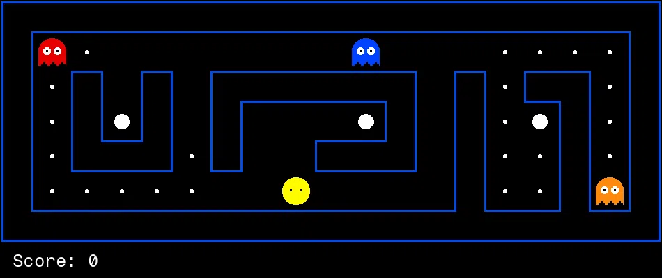
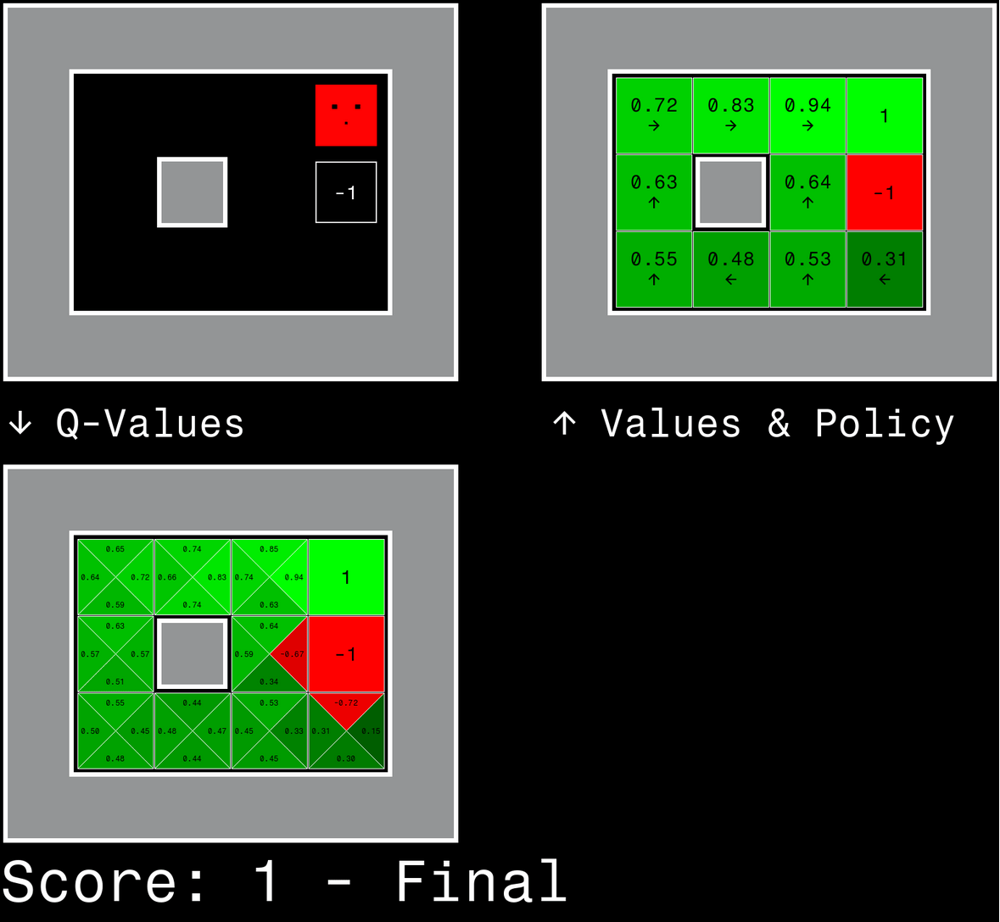
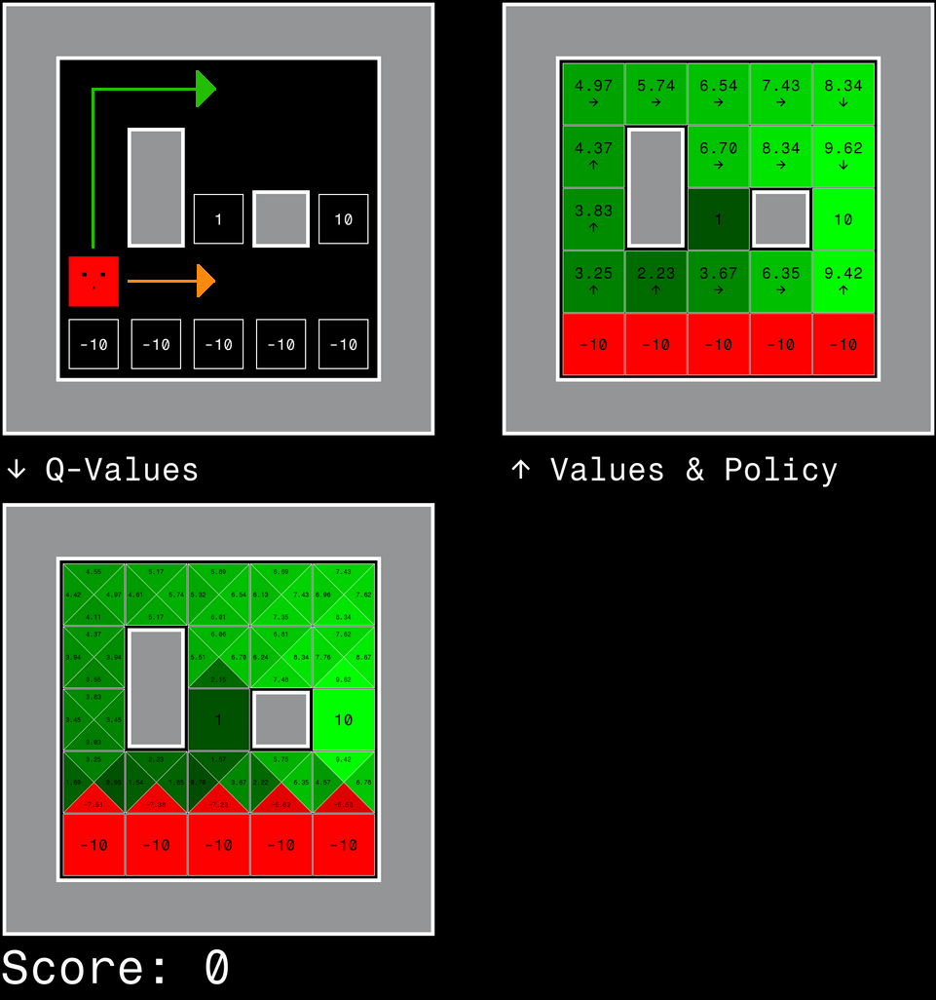

# Project 3: Reinforcement Learning

<p align="center">
    
    </br>
    Pac-Man seeks reward.<br/>
    Should he eat or should he run?<br/>
    When in doubt, Q-learn.
</p>

## Introduction

In this project, you will implement
[value iteration](https://en.wikipedia.org/wiki/Markov_decision_process#Value_iteration)
and [Q-learning](https://en.wikipedia.org/wiki/Q-learning).
You will test your agents first on Gridworld (from class),
then apply them to Pac-Man.

The code for this project consists of several Python files,
some of which you will need to read and understand in order to complete the assignment, and some you can glance over.

### Submission

You will fill in portions of
[`pacai/student/learning.py`](https://github.com/edulinq/pacai/blob/v2.0.0/pacai/student/learning.py)
and [`pacai/student/learning-questions.py`](https://github.com/edulinq/pacai/blob/v2.0.0/pacai/student/learning_questions.py)
during this assignment.
You should **only** submit these two files.
Unless told otherwise, you may create whatever supporting functions, methods, and members you need,
as long as they are in the submitted file(s).

For instructions on submission,
refer back to the [P0 README](../p0/README.md).
for example, you may submit with the command:
```sh
python3 -m autograder.run.submit pacai/student/learning.py pacai/student/learning-questions.py
```

### Evaluation

Your code will be autograded for technical correctness.
Please _do not_ change the names of any provided functions or classes within the code,
or you will wreak havoc on the autograder (and points will be deducted!).
However, you are allowed to add any new classes or function that you need.
The correctness of your implementation -- not the autograder's output -- will be the final judge of your score.
If necessary, we will review and grade assignments individually to ensure that you receive due credit for your work.
This assignment is graded out of 30 points.
25 points will be for correctness as determined by the autograder and the point system given below for each problem.
5 points will be for style, which the autograder will also check.
You can run the style checker using the `run_style.sh` script in the project root.

### Academic Dishonesty

We will be checking your code against other submissions in the class for logical redundancy.
If you copy someone else's code and submit it with minor changes, we will know.
These cheat detectors are quite hard to fool, so please don't try.
We trust you all to submit your own work only; _please_ don't let us down.
If you do, we will pursue the strongest consequences available to us.

### Getting Help

You are not alone!
If you find yourself stuck on something, contact the course staff for help.
Office hours, section, and Piazza are there for your support; please use them.
If you can't make our office hours, let us know and we will schedule more.
We want these projects to be rewarding and instructional, not frustrating and demoralizing.
But, we don't know when or how to help unless you ask.
One more piece of advice: if you don't know what a variable does or what kind of values it takes, print it out.

### Code

All the code for this (and later projects) is available in this repository:
[https://github.com/edulinq/pacai](https://github.com/edulinq/pacai).
The only files you should edit are located in the
[pacai.student](https://github.com/edulinq/pacai/tree/v2.0.0/pacai/student) package.
You should **not** use any third-party libraries,
but the [Python Standard Library](https://docs.python.org/3/library/) is fair-game.
If a bug is found in the code (non-student) code,
then the class will be alerted and you will have to pull the changes from this repository.

Any commands provided throughout these instructions are to be executed from the project root directory
(the one with the `README.md` and `LICENSE.md` files).

 - Core Engine Elements
   - [pacai.core.action.Action](https://edulinq.github.io/pacai/docs/v2.0.0/pacai/core/action.html#Action)
   - [pacai.core.board.Board](https://edulinq.github.io/pacai/docs/v2.0.0/pacai/core/board.html#Board)
   - [pacai.core.board.Position](https://edulinq.github.io/pacai/docs/v2.0.0/pacai/core/board.html#Position)
   - [pacai.core.mdp.MarkovDecisionProcess](https://edulinq.github.io/pacai/docs/v2.0.0/pacai/core/mdp.html#MarkovDecisionProcess)
   - [pacai.gridworld.mdp.GridWorldMDP](https://edulinq.github.io/pacai/docs/v2.0.0/pacai/gridworld/mdp.html#GridWorldMDP)
 - Agents
   - [pacai.core.agent Agent](https://edulinq.github.io/pacai/docs/v2.0.0/pacai/core/agent.html#Agent)
   - [pacai.agents.mdp.MDPAgent](https://edulinq.github.io/pacai/docs/v2.0.0/pacai/agents/mdp.html#MDPAgent)

## GridWorld & MDPs

GridWorld is a whole new and dangerous world for your agents to explore!
In GridWorld, your agent (the red square) wants to make it to a goal.
Goals are the terminal states (the ones with numbers) with a positive number.
There are no opposing agents in this world, but there are still dangers.
If your agent enters a negative terminal state, they will lose.
Should be super easy, right?
Unfortunately, actions taken within GridWorld are not guaranteed.
Every time your agent moves in a directions, it may accidentally "slip" in the wrong direction.
Let's see this in action:
```sh
python3 -m pacai.gridworld
```

Here you can see the two-exit board (called `gridworld-book`) from class.
Your agent starts in the lower left corner.
Terminal states (the boxes with number in them) are the exits in this world.
Reaching one will cause the game to end.
Reaching a positive terminal state will "win" the game,
and reaching a negative terminal state will "lose" the game.

You can use the normal Pac-Man controls (arrows or WASD) to control your agent.
Notice that when you try to go in a direction, the agent will only obey about 80% of the time.
You can really obviously see this if you tell you agent to constantly bonk into the wall.
Eventually the agent will move to the side instead.
You can think of this as the agent accidentally "slipping" in one of the other directions
(maybe the floor in GridWorld is always slippery).
An agent will never "slip" backwards.

Under the hood, GridWorld is an environment that is controlled by a simple [Markov Decision Process (MDP)](https://en.wikipedia.org/wiki/Markov_decision_process).
So, transitioning between states (moving between squares) has a probabilistic component to it.
In this assignment, we will create agents that know about the underlying MDP (value iteration)
and agents that try to model the underlying MDP without knowing about the details.

You can control many aspects of GridWorld just like you do with Pac-Man.
A full list of options is available by running:
```sh
python3 -m pacai.gridworld --help
```

For example, if you want your agent to disobey 50% of the time, just increase the noise:
```sh
python3 -m pacai.gridworld --noise 0.5
```

Many of the agents you are familiar with from Pac-Man still work here.
There's no food or ghosts so several agents will get pretty confused,
but simple agents should do fine.
You can set the agent with `--agent`.
For example, you can use the random agent with:
```sh
python3 -m pacai.gridworld --agent agent-random
```

Since this grid is small and the game may end fast,
don't forget that you can set the FPS with `--fps`:
```sh
python3 -m pacai.gridworld --agent agent-random --fps 2
```

It's hard to see the agent misbehaving when you are not controlling it directly.
You can use `--debug` to see more information:
```sh
python3 -m pacai.gridworld --agent agent-random --fps 2 --debug
```

There are several GridWorld boards already provided for you.
We will only be using a few in this assignment,
but feel free to try them out:
 - `gridworld-book` -- The default one (not that scary).
 - `gridworld-bridge` -- A super scary bridge of doom.
 - `gridworld-cliff` -- A medium-scary cliff.
 - `gridworld-cliff2` -- A cliff that is less scary then the other cliff, but still a little scary.
 - `gridworld-discount` -- More "risky" than "scary".
 - `gridworld-maze` -- Not scary at all, but maybe a little spooky.

Just like with Pac-Man, choose your board with `--board`:
```sh
python3 -m pacai.gridworld --board gridworld-maze
```

_Note:_
Ending a game for GridWorld has some nuances to it.
You end a game by stepping on a square that has number on it with the box around it.
These are technically called "pre-terminal" states.
Once you are on that, you agent is then forced to take the "EXIT" action and enter a "terminal" state,
which then causes it to exit/end the game/round/episode.
This behavior matches more closely with what you may see in your textbook,
since there are theoretical reasons that it makes more sense than just exiting directly.
If you run with `--debug`, you can see your agent enter the per-terminal state,
get a reward, and then be forced to take the "EXIT" action.

If your games ever appear to be "hanging" (especially if you have no UI or debug output),
then your agent may just be getting stuck in a cycle where they move between the same set of positions.
You can always turn on the UI or use `--debug` to see if this is happening.
If your code is written correctly, we don't anticipate this happening.
(But it could always happen with correct code and non-optimal variable settings.)
You can use `--max-turns 1000` to ensure that games like this get stopped.

### Question 1 (6 points)

For our first agent, we will implement a [value iteration](https://en.wikipedia.org/wiki/Markov_decision_process#Value_iteration) agent
in [pacai.student.learning.ValueIterationAgent](https://edulinq.github.io/pacai/docs/v2.0.0/pacai/student/learning.html#ValueIterationAgent).
This agent is not only aware that the environment/world is controlled by an MDP,
but has the exact parameters of that MDP
(available as [pacai.student.learning.ValueIterationAgent.mdp](https://edulinq.github.io/pacai/docs/v2.0.0/pacai/student/learning.html#ValueIterationAgent.mdp)).
Since this agent has a copy of the MDP that the game/environment is using,
it can just simulate games using that same MDP to come up with a good policy to follow.

This agent is a subclass of [pacai.agents.mdp.MDPAgent](https://edulinq.github.io/pacai/docs/v2.0.0/pacai/agents/mdp.html#MDPAgent),
and both of these classes have provided most of the infrastructure you need already.
A lot of the existing code is just to properly display values in the Q-Display.
Make sure to carefully take a look at all the provided code.
Note that if you see a method without a comment,
that is because it is inheriting that comment from its parent (which will show up in documentation, but not the code).
You will have to implement the following methods (but you may create whatever else in this file you need):
 - [`do_value_iteration()`](https://edulinq.github.io/pacai/docs/v2.0.0/pacai/student/learning.html#ValueIterationAgent.do_value_iteration) -- Perform value iteration.
 - [`get_qvalue()`](https://edulinq.github.io/pacai/docs/v2.0.0/pacai/student/learning.html#ValueIterationAgent.get_qvalue) -- Fetch a Q-value for an MDP state and action.
 - [`get_policy_action()`](https://edulinq.github.io/pacai/docs/v2.0.0/pacai/student/learning.html#ValueIterationAgent.get_policy_action) -- Fetch the policy action for an MDP state.

Make sure to use the "batch" version of value iteration where each vector $V_k$ is computed from a fixed vector $V_{k-1}$ (like in lecture),
not the "online" version where one single weight vector is updated in place.
The difference is discussed in [Sutton & Barto](http://incompleteideas.net/book/RLbook2018.pdf#page=97) starting in 4th paragraph of section 4.1.

If you need randomness (e.g., to break a tie),
you can use your agent's [RNG](https://docs.python.org/3/library/random.html#random.Random) accessible via `self.rng`.
It will have already been seeded in a repeatable way by the game engine.

Once implemented, you can run your agent with:
```sh
python3 -m pacai.gridworld --agent agent-value-iteration
```

To help you understand what your agent is thinking, you can use GridWorld's Q-Display:
```sh
python3 -m pacai.gridworld --agent agent-value-iteration --qdisplay
```

<center>
    
</center>

This extended display is specifically made for GridWorld.
It shows your standard board in the upper left.
There are copies of the board to its right and bottom showing different sets of values.
The board on the right shows the MDP state values for each position along with the policy action (as an arrow).
The board on the bottom shows the Q-values for each MDP state and action (the top triangle for north, the right for east, etc).
Positive values are shown in green, while negative values are shown in red.
More vibrant colors indicate numbers with a larger magnitude.
This display will be particularly useful as we start to train agents over multiple games.

You can visualize how your agent is learning by using the Q-Display and using fewer value iterations:
```sh
# 1 Value Iteration
python3 -m pacai.gridworld --agent agent-value-iteration --qdisplay --agent-arg 0::iterations=1

# 3 Value Iterations
python3 -m pacai.gridworld --agent agent-value-iteration --qdisplay --agent-arg 0::iterations=3

# 5 Value Iterations
python3 -m pacai.gridworld --agent agent-value-iteration --qdisplay --agent-arg 0::iterations=5
```

You agent should be able to win almost 100% of the time on `gridworld-book` (the default board) after only 50 value iterations.
```sh
python3 -m pacai.gridworld --agent agent-value-iteration --agent-arg 0::iterations=50 --ui null --num-games 100
```

Note that this value iteration agent would fall into the category of "offline planning", and not "reinforcement learning".
At the start of the game, the agent looks at its copy of the MDP (its model of the world/universe/physics) and simulates the possible things that can happen.
The agent is not getting active feedback from the world itself.

To get full credit you should be able to win `gridworld-book` 95% of the time with 50 value iterations:
```sh
python3 -m pacai.gridworld --agent agent-value-iteration --agent-arg 0::iterations=50 --ui null --num-games 100
```

### Question 2 (1 point)

On `gridworld-bridge` with the default discount rate of 0.9 and the default noise of 0.2,
the optimal policy does not cross the bridge.
You agent will be too scared to cross:
```sh
python3 -m pacai.gridworld --agent agent-value-iteration --board gridworld-bridge --qdisplay --noise 0.2 --agent-arg 0::discount_rate=0.9
```

Change only **ONE** of the discount and noise parameters (and nothing else) so that the optimal policy causes your agent to attempt to cross the bridge.
(They may not make it, but they at least need to try.)
Put your answer in the [pacai.student.analysis.learning-questions.question_2](https://edulinq.github.io/pacai/docs/v2.0.0/pacai/student/learning_questions.html#question_2) function.

### Question 3 (5 points)

Consider the `gridworld-discount` board, shown in the image below.
This grid has two terminal states with a positive payoff,
a close exit with payoff +1 and a distant exit with payoff +10.
The bottom row of the grid consists of terminal states with negative payoff.
Each state in this lower "cliff" region has payoff -10.
The agent is shows in the starting state.

We distinguish between two types of paths:
1. Paths that "risk the cliff" and travel near the bottom row of the grid.
   These paths are shorter but risk earning a large negative payoff.
   These paths are represented by the orange arrow in the figure below.
2. Paths that "avoid the cliff" and travel along the top edge of the grid.
   These paths are longer but are less likely to incur huge negative payoffs.
   These paths are represented by the green arrow in the figure below:

<center>
    
</center>

Give an assignment of parameter values for discount, noise, and living-reward
which produce the following optimal policy types or state that the policy is impossible by returning a single `None`.
Unlike Question 2, you may change any of these three values.
The default options corresponds to:
```sh
python3 -m pacai.gridworld --agent agent-value-iteration --board gridworld-discount --qdisplay --noise 0.2 --living-reward 0.0 --agent-arg 0::discount_rate=0.9
```

 - [question_3a](https://edulinq.github.io/pacai/docs/v2.0.0/pacai/student/learning_questions.html#question_3a) -- Prefer the close exit (+1), risking the cliff (orange direction)).
 - [question_3b](https://edulinq.github.io/pacai/docs/v2.0.0/pacai/student/learning_questions.html#question_3b) -- Prefer the close exit (+1), but avoiding the cliff (green direction).
 - [question_3c](https://edulinq.github.io/pacai/docs/v2.0.0/pacai/student/learning_questions.html#question_3c) -- Prefer the distant exit (+10), risking the cliff (orange direction).
 - [question_3d](https://edulinq.github.io/pacai/docs/v2.0.0/pacai/student/learning_questions.html#question_3d) -- Prefer the distant exit (+10), avoiding the cliff (green direction).
 - [question_3e](https://edulinq.github.io/pacai/docs/v2.0.0/pacai/student/learning_questions.html#question_3e) -- Avoid both exits (also avoiding the cliff).

To check your choices using the GUI,
make sure you pay attention to the "Values & Policy" screen and not just what your agent does.
Remember that your agent will not always move in the intended direction,
but we are checking if your **policy** is correct.
(So we are checking that your agent wants to do the right thing, even if they don't actually do the right thing.)

To test the last scenario (`question_3e`), you can use `--max-turns` with no UI to quickly simulate a bunch of turns:
```sh
python3 -m pacai.gridworld --agent agent-value-iteration --board gridworld-discount --noise 0.2 --living-reward 0.0 --agent-arg 0::discount_rate=0.9 --ui null --max-turns 10000
```

We will score you by running games with your provided numbers and looking at your actions and scores.
For each question, there may be many possible solutions (if any).
To help the grader, try to keep your discount and noise in [0.0, 1.0],
and your living reward in [-10.0, 10.0].
If you know your values work but the grader does not give you the score you expect,
try to find another set of values.

## Q-learning

Note that your value iteration agent does not actually learn from experience.
Rather, it ponders its MDP model to arrive at a complete policy before ever interacting with a real environment.
When it does interact with the environment,
it simply follows the precomputed policy (e.g. it becomes a reflex agent).
This distinction may be subtle in a simulated environment like a GridWorld,
but it's very important in the real world, where the real MDP is not available.

Next in this assignment, we will create agents that use [Q-learning](https://en.wikipedia.org/wiki/Q-learning)
to learn from the environment as it progresses through the game.
Note that pacai will probably be using different variables names than the ones used in your resources describing Q-learning:

| Classical Q-Learning Terminology | General Name         | pacai Variable                                     |
|----------------------------------|----------------------|----------------------------------------------------|
| α / Alpha                        | Learning Rate        | [pacai.agents.mdp.MDPAgent.learning_rate](https://edulinq.github.io/pacai/docs/v2.0.0/pacai/agents/mdp.html#MDPAgent.learning_rate) |
| γ / Gamma                        | Discount Rate/Factor | [pacai.agents.mdp.MDPAgent.discount_rate](https://edulinq.github.io/pacai/docs/v2.0.0/pacai/agents/mdp.html#MDPAgent.discount_rate) |
| ε / Epsilon                      | Exploration Rate     | [pacai.agents.mdp.MDPAgent.exploration_rate](https://edulinq.github.io/pacai/docs/v2.0.0/pacai/agents/mdp.html#MDPAgent.exploration_rate) |

### Question 4 (5 points)

You will now implement the core code for a Q-learning agent in [pacai.student.learning.QLearningAgent](https://edulinq.github.io/pacai/docs/v2.0.0/pacai/student/learning.html#QLearningAgent).
This agent starts off knowing very little about its environment,
but learns via its [pacai.student.learning.QLearningAgent.update_qvalue()](https://edulinq.github.io/pacai/docs/v2.0.0/pacai/student/learning.html#QLearningAgent.get_qvalue) method.

Like your value iteration agent, this agent is also a subclass of [pacai.agents.mdp.MDPAgent](https://edulinq.github.io/pacai/docs/v2.0.0/pacai/agents/mdp.html#MDPAgent).
Make sure you thoroughly read and understand the existing code before you start.
You will have to implement the following methods (but you may create whatever else in this file you need):
 - [`update_qvalue()`](https://edulinq.github.io/pacai/docs/v2.0.0/pacai/student/learning.html#QLearningAgent.update_qvalue) -- Take in information from the previous and current states to update the agent's view of the world.
 - [`get_action()`](https://edulinq.github.io/pacai/docs/v2.0.0/pacai/student/learning.html#QLearningAgent.get_action) -- Decide on the next action for this agent.
 - [`get_mdp_state_value()`](https://edulinq.github.io/pacai/docs/v2.0.0/pacai/student/learning.html#QLearningAgent.get_mdp_state_value) -- Fetch the value for the given MDP state.
 - [`get_policy_action()`](https://edulinq.github.io/pacai/docs/v2.0.0/pacai/student/learning.html#QLearningAgent.get_policy_action) -- Fetch the policy action for an MDP state.

Your agent will learn over several different games (set via the `--num-training` flag).
The first time your agent runs, it will have no prior information.
However, each time after that your agent will be passed the Q-values from its previous game/epoch.
(We will refer to each game run during training as a ["training epoch"](https://deepai.org/machine-learning-glossary-and-terms/epoch),
which is a more general way to refer to training a model.)
This information will be loaded via
[`pack_training_info()`](https://edulinq.github.io/pacai/docs/v2.0.0/pacai/student/learning.html#QLearningAgent.pack_training_info)
and [`unpack_training_info()`](https://edulinq.github.io/pacai/docs/v2.0.0/pacai/student/learning.html#QLearningAgent.unpack_training_info),
which are already implemented for you.
So for each epoch, you will have a fresh agent that gets the Q-values from the previous epoch.
Once training is over, you agent will always get the Q-values from your last training epoch.
You can tell if you agent is currently training via the [pacai.core.agent.Agent.training](https://edulinq.github.io/pacai/docs/v2.0.0/pacai/core/agent.html#Agent.training) variable.
During learning/training, a Q-learning agent may explore,
otherwise the Q-learning agent is supposed to strictly follow the policy.

To help you debug your code,
we have provided the [pacai.student.learning.QLearningUserInputAgent](https://edulinq.github.io/pacai/docs/v2.0.0/pacai/student/learning.html#QLearningUserInputAgent).
This agent is a subclass of your Q-learning agent,
but takes input from you instead of using it's policy.
This way, you can see how different actions will affect your learned values.
```sh
python3 -m pacai.gridworld --agent agent-qlearning-user --qdisplay --num-training 10 --num-games 0 --show-training-ui
```

This will let you play 10 training games where you can see the Q-Display update between epochs.
Note that by default the UI is not shown during training (since you may be training for hundreds of epochs).
To see the UI during training, you need to use `--show-training-ui`.

You can also use the `--debug` flag to get more information about your agent:
```sh
python3 -m pacai.gridworld --agent agent-qlearning --num-training 10 --num-games 0 --ui null --debug
```

With just 20 epochs of training, your agent should be winning on the default board almost 100% of the time:
```sh
python3 -m pacai.gridworld --agent agent-qlearning --num-training 20 --num-games 100 --ui null
```

Try re-running this command several times.
Notice that there may be a few times (maybe 1-2 out of 10) where you agent wins less than 90% of the games.
This is just the nature of reinforcement learning, when you may just get unlucky at some point in training.
In more robust training schemes, we have techniques to help detect and mitigate these scenarios.

It's also very interesting to see you agent learn over each epoch.
Watch as your agent develops its policy and becomes more confident:
```sh
python3 -m pacai.gridworld --agent agent-qlearning --qdisplay --num-training 20 --show-training-ui
```

To get credit for this part, your agent should be able to win at least 85% of the games with 20 training epochs:
```sh
python3 -m pacai.gridworld --agent agent-qlearning --num-training 20 --num-games 100 --ui null
```

### Question 5 (1 points)

First, train a completely random Q-learning agent `gridworld-bridge` for 50 epochs
with the default learning rate, full exploration, and no noise,
and look at what kind of policy your agent develops:
```sh
python3 -m pacai.gridworld --agent agent-qlearning --board gridworld-bridge --qdisplay --num-training 50 --noise 0.0 --agent-arg 0::learning_rate=0.5 --agent-arg 0::exploration_rate=1.0
```

Now try again with no exploration:
```sh
python3 -m pacai.gridworld --agent agent-qlearning --board gridworld-bridge --qdisplay --num-training 50 --noise 0.0 --agent-arg 0::learning_rate=0.5 --agent-arg 0::exploration_rate=0.0
```

Is there a set of values for the learning and exploration rates that make it highly likely (greater than 99%)
for your agent to develop a policy that crosses the bridge to reach the 10 point exit?
Put your answer in the [pacai.student.analysis.learning-questions.question_6](https://edulinq.github.io/pacai/docs/v2.0.0/pacai/student/learning_questions.html#question_5) function.
If there is no such pair of values, return a single `None`.

## State Abstraction

Time to play some Pac-Man!

Up until now we have been playing on GridWorld,
which was specifically designed to be used for reinforcement learning.
Now, we will be learning on a normal game of Pac-Man!
Just like before, we will run a certain number of training games that we can learn during,
and then we will play some real games to check our score.
For Pac-Man, we will need to train for far longer than GridWorld, since the game and representation is much more complex.

Be aware that Pac-Man does not have a Q-Display available.

### Question 6 (1 points)

Your Q-learning agent should be able to play Pac-Man without any modifications:
```sh
python3 -m pacai.pacman --pacman agent-qlearning --board grid-small --num-training 300 --num-games 20
```

_Side Note on MDP State Representation_:
In GridWorld, the MDP state can be represented just with a position,
i.e., we know everything we need to know about our MDP state just by knowing where we are.
Pac-Man, however, is much more complex and needs to know about more things like the ghost positions, food/pellets, capsules, etc.
Therefore, while GridWorld will use the very fast
[pacai.core.mdp.MDPStatePosition](https://edulinq.github.io/pacai/docs/v2.0.0/pacai/core/mdp.html#MDPStatePosition) class,
Pac-Man must use the more complex (and slower)
[pacai.core.mdp.MDPStateBoard](https://edulinq.github.io/pacai/docs/v2.0.0/pacai/core/mdp.html#MDPStateBoard) class.
These state classes are chosen automatically, and don't require any action from you.
The speed difference should be fairly noticeable.

Make sure you understand what is happening here: the MDP state is the _exact_ board configuration facing Pac-Man,
with the now complex transitions describing an entire ply of change to that state.
The intermediate game configurations in which Pac-Man has moved but the ghosts have not replied are _not_ MDP states,
but are bundled in to the transitions.
You agent only gets to see the state when it is its turn to move,
it does not get a chance to see the state before or between ghost movements.

Your agent should be winning fairly reliably (>= 85%) on `grid-small` with just 300 training epochs.
However, you'll find that training the same agent on the seemingly simple `classic-small` may not work well:
```sh
python3 -m pacai.pacman --pacman agent-qlearning --board classic-small --num-training 300 --num-games 20
```

You likely didn't win even a single game.
Pac-Man fails to win on larger boards because each board configuration is a separate state with separate Q-values.
Your agent has no way to generalize that running into a ghost is bad for all positions.
Obviously, this approach will not scale.

You will be graded based on your performance on `grid-small`.
You should be able to win at least 75% of the games:
```sh
python3 -m pacai.pacman --pacman agent-qlearning --board grid-small --num-training 300 --num-games 20 --ui null
```

Note that if you coded your Q-Learning agent properly in previous parts,
you may not have to do anything for this question.

## Approximate Q-learning and State Abstraction

As we saw in the last question,
out Q-learning agent can work quite well when there are a limited number of possible MDP states.
But when the state space is large (like games with bigger boards or several agents),
our Q-learning agent falls flat.
This is mainly because the MDP state space (the number of possible MDP states) is so large
that we will likely not be able to see all of the possible states in training (unless we train for a ridiculous amount of time).

This is where [features](https://en.wikipedia.org/wiki/Feature_(machine_learning)) can help us out.
Instead of _exactly_ representing our MDP state using the current board,
we can _approximately_ represent our MDP state using features.
This is called ["Approximate Q-Learning"](https://en.wikipedia.org/wiki/Q-learning#Function_approximation).

In approximate Q-learning we will have a "feature function", $ f $,
which will take in a state $ s $ and action $ a $ pair,
and output a vector of features:
$ f(s, a) = f_1(s, a), f_2(s, a), ... f_n(s, a) $.
pacai provides some infrastructure for features and feature functions in
[pacai.core.features](https://edulinq.github.io/pacai/docs/v2.0.0/pacai/core/features.html).
In pacai, features are typically held in a [pacai.core.features.FeatureDict](https://edulinq.github.io/pacai/docs/v2.0.0/pacai/core/features.html#FeatureDict),
which is a dictionary instead of a vector.
This is just for convenience and clarity,
since it is usually easier to debug your features when you can see the key associated with each one.
Missing features are assumed to be 0.
You can see a trivial feature function in
[pacai.core.features.score_feature_extractor()](https://edulinq.github.io/pacai/docs/v2.0.0/pacai/core/features.html#score_feature_extractor),
and a more complex one (specifically made for Pac-Man) in
[pacai.pacman.features.simple_feature_extractor()](https://edulinq.github.io/pacai/docs/v2.0.0/pacai/pacman/features.html#simple_feature_extractor).

Once features are computed,
approximate Q-learning computes a Q-value by taking the [dot product](https://en.wikipedia.org/wiki/Dot_product)
of the features with a vector of learned weights:
```math
    \begin{align}
        Q(s, a) &= f(s, a) \cdot w \\
                &= \sum_i^n f_i(s, a) * w_i
    \end{align}
```

As your agent learns, it can updated its weights (which will also update the Q-values) with:
```math
    \begin{align}
        w_i        &\leftarrow w_i + \alpha * [correction] * f_i(s,a) \\
        correction &= (R(s, a) + \gamma * V'(s)) - Q(s, a)
    \end{align}
```

Where
$ R(s, a) is the reward for taking action $ a $ on state $ s $
and $ V'(s) $ is the MDP state value of $ s $.
Note that this should look a lot like normal Q-learning.

### Question 7 (3 points)

Implement your own approximate Q-learning agent in
[pacai.student.learning.ApproximateQLearningAgent](https://edulinq.github.io/pacai/docs/v2.0.0/pacai/student/learning.html#ApproximateQLearningAgent).
This agent is a subclass of your [pacai.student.learning.QLearningAgent](https://edulinq.github.io/pacai/docs/v2.0.0/pacai/student/learning.html#QLearningAgent),
but should not use the `qvalues` member.
Instead, you will learn values for `weights` during training,
and use those (with features) to compute Q-values.
You will have to implement the following methods (but you may create whatever else in this file you need):
 - [`get_qvalue()`](https://edulinq.github.io/pacai/docs/v2.0.0/pacai/student/learning.html#ApproximateQLearningAgent.get_qvalue) -- Fetch a Q-value for an MDP state and action.
 - [`update_qvalue()`](https://edulinq.github.io/pacai/docs/v2.0.0/pacai/student/learning.html#ApproximateQLearningAgent.update_qvalue) -- Take in information from the previous and current states to update the agent's view of the world.

A feature function will be available to your agent in
[pacai.student.learning.ApproximateQLearningAgent.feature_extractor_func](https://edulinq.github.io/pacai/docs/v2.0.0/pacai/student/learning.html#ApproximateQLearningAgent.feature_extractor_func).
This function defaults to [pacai.core.features.score_feature_extractor()](https://edulinq.github.io/pacai/docs/v2.0.0/pacai/core/features.html#score_feature_extractor).
This function is general and will work for every type of game,
but (as we saw with P2's reflect agent) will not work well with Pac-Man:
```sh
python3 -m pacai.pacman --pacman agent-qlearning-approx --board grid-small --num-training 300 --num-games 20
```

Instead we can use [pacai.core.features.board_feature_extractor()](https://edulinq.github.io/pacai/docs/v2.0.0/pacai/core/features.html#board_feature_extractor),
which creates a unique feature for each state/action pair and gives it a value of 1.0.
This means that our agent is learning a weight for each unique state/action pair,
which should be exactly the same as normal Q-learning:
```sh
python3 -m pacai.pacman --pacman agent-qlearning-approx --board grid-small --num-training 300 --num-games 20 --agent-arg 0::feature_extractor_func=feature-extractor-board
```

Of course we don't just want to match our old agent,
we want to beat it!
So, let's try a real feature extractor,
[pacai.pacman.features.simple_feature_extractor()](https://edulinq.github.io/pacai/docs/v2.0.0/pacai/pacman/features.html#simple_feature_extractor),
which was made for Pac-Man:
```sh
python3 -m pacai.pacman --pacman agent-qlearning-approx --board grid-small --num-training 300 --num-games 20 --agent-arg 0::feature_extractor_func=feature-extractor-pacman-simple
```

It does fine, but it typically will not beat the normal Q-learning agent on `grid-small`.
Remember, the normal Q-learning agent does well on small/simple boards.
Let's try again on a board that the normal Q-learning agent could not win on:
```sh
python3 -m pacai.pacman --pacman agent-qlearning-approx --board classic-small --num-training 50 --num-games 20 --agent-arg 0::feature_extractor_func=feature-extractor-pacman-simple
```

Nice!
We can win pretty consistently (>= 80%) on a fairly complex board,
and we even trained way less.
Even larger boards should be no match for your agent:
```sh
python3 -m pacai.pacman --pacman agent-qlearning-approx --board classic-medium --num-training 50 --num-games 20 --agent-arg 0::feature_extractor_func=feature-extractor-pacman-simple
```

If you get real lucky, you may be able to win with a very small number of training games:
```sh
python3 -m pacai.pacman --pacman agent-qlearning-approx --board classic-medium --num-training 5 --num-games 20 --agent-arg 0::feature_extractor_func=feature-extractor-pacman-simple
```

You will be graded based on your performance on `classic-small`.
You should be able to win at least 50% of the games with only 20 training games:
```sh
python3 -m pacai.pacman --pacman agent-qlearning-approx --board classic-small --num-training 20 --num-games 100 --ui null --agent-arg 0::feature_extractor_func=feature-extractor-pacman-simple
```

<i>Congratulations! You have a learning Pac-Man agent!</i>
